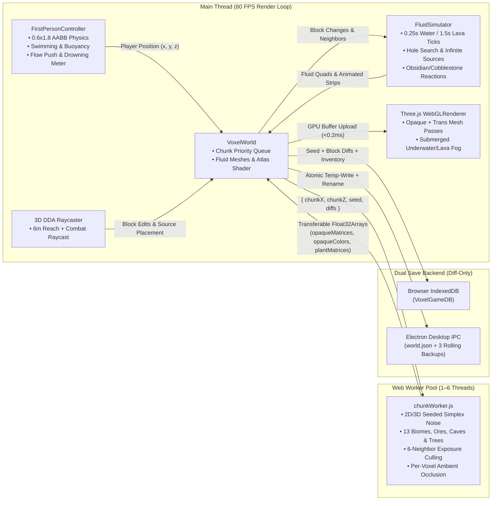
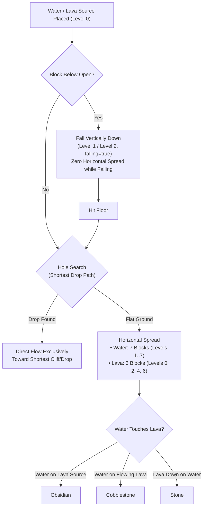
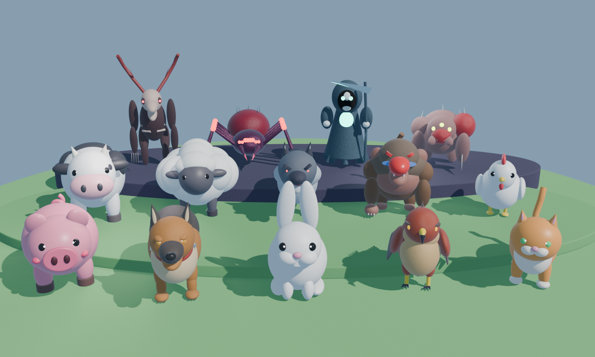
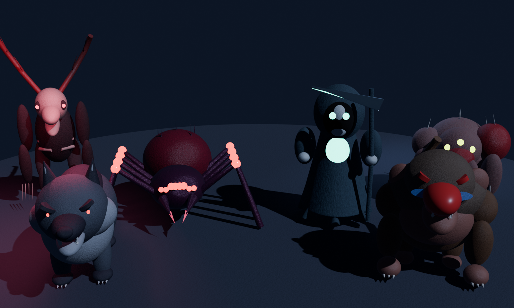

# Voxel Realms v2.0 — 3D Voxel Sandbox Engine (Three.js + Vite + Web Workers + Electron)

[](https://threejs.org/)
[](https://vitejs.dev/)
[](https://www.electronjs.org/)
[]()
[]()

**Voxel Realms** is a full-featured, browser- and desktop-ready 3D voxel sandbox game built from the ground up using **Three.js**, **Vite**, **ES Module Web Workers**, **Web Audio API**, **IndexedDB**, and **Electron**.

It implements **all 7 Core Development Phases (`Phases 0–6`)**, **all 8 Advanced Upgrade Phases (`Phases U0–U7`)**, and the complete **Minecraft-Style Fluid Physics Simulation, Multi-Attack Combat AI, 4-Season Climate Engine, and 14 Sculpted Blender Mobs**.

---

## 📐 System Architecture

### 1. Multi-Threaded Chunk Generation & Rendering Pipeline


### 2. Core Engineering Principles
1. **Single Source of Truth Data Model:** Every chunk owns a `Map<"wx,wy,wz", blockType>` representing its solid and transparent voxels, and a dedicated `fluids` map for simulated water and lava flow. Visual meshes are strictly derived from this state.
2. **Off-Main-Thread Web Worker Meshing (`0 ms` UI Stalls):** Terrain noise sampling (`fbm2D` + `noise3D`), tree generation, 6-neighbor exposure culling, and per-voxel Ambient Occlusion execute inside a pool of background Web Workers (`src/workers/chunkWorker.js`) using zero-copy transferable `Float32Array` buffers.
3. **Discrete Fluid Simulation Budgeting:** Liquid updates run on a scheduled priority queue capped at 200 block updates per frame with 100ms debounced chunk re-meshing (`src/fluids/FluidSimulator.js`).
4. **Deterministic Seeded Diff Persistence:** Natural terrain and settled water generate deterministically from the numeric seed (`133742`). Save files store **only player modifications** (`world.modifiedBlocks` diffs: broken blocks as `null` and placed blocks as `blockType`), keeping save payloads tiny regardless of world exploration distance.

---

## 🌊 Minecraft-Style Fluid Physics Simulation (`src/fluids/`)

Voxel Realms features a faithful, high-performance fluid simulation reproducing Minecraft's liquid mechanics:



### 1. Simulation Rules & Reactions
- **Water Behavior:** 0.25s tick delay; spreads horizontally up to 7 blocks (levels 1–7); drops by 1 level per block; 4-block hole search pathfinding.
- **Lava Behavior:** 1.5s tick delay (slower, viscous); spreads up to 3 blocks (levels 0, 2, 4, 6); drops by 2 levels per block; 2-block hole search pathfinding.
- **Infinite Water Sources:** Formed whenever an empty block has 2+ horizontally adjacent water sources over a solid or source floor.
- **Flow Retreat:** When a source block is removed, flowing liquid retreats and clears cleanly without leaving orphan fluid blocks.
- **Thermal Block Reactions:**
  - Water flowing horizontally over a Lava Source $\rightarrow$ **Obsidian**.
  - Water touching Flowing Lava $\rightarrow$ **Cobblestone**.
  - Lava falling vertically onto Water $\rightarrow$ **Stone**.

### 2. Variable-Height Quad Meshing & Animations (`src/fluids/FluidMesher.js`)
- **Variable Quad Heights:** Fluid surface height is calculated per corner using the Minecraft formula:
  $$h = \frac{8 - \text{level}}{9.0}$$
  (Falling columns and source blocks with fluid above render at a full height of `1.0`).
- **Smooth 4-Corner Averaging:** Each vertex height is averaged across adjacent fluid blocks to generate smooth downward slopes.
- **Animated 16-Frame Strips:** Real-time 10 Hz texture frame animation cycling 16 frames on 32×512 vertical strips for `water_still.png`, `water_flow.png`, `lava_still.png`, and `lava_flow.png`.

### 3. Entity Buoyancy, Swimming & Drowning Physics (`src/controls.js`)
- **Water Swimming:** Holding `Space` swims upward at **3.5 m/s**; sinking is clamped to a **2.0 m/s** terminal velocity; horizontal speed is damped to **0.5×** (or **0.72×** while sprinting).
- **Fall Damage Negation:** Entering water or lava instantly clears accumulated fall distance (`highestAirY = playerPosition.y`).
- **Fire & Lava Damage:** Lava deals **4 HP damage every 0.5s**; swimming in lava is clamped to **1.5 m/s** upward and **1.0 m/s** sink; exiting lava inflicts a **15-second fire burn** (1 HP/s). Stepping into water immediately extinguishes burning fire.
- **Fluid Flow Push Force:** Downward drag in falling fluid columns (**3.2 m/s**) and horizontal pushing downstream along surface gradients (**1.8 m/s**).
- **Oxygen & Drowning Meter:** Submerging the player's head depletes an air supply lasting **15.0 seconds** (represented by 10 animated bubbles on `#oxygen-bar`); running out of oxygen deals **2.0 DPS drowning damage**; oxygen refills at **5 bubbles/second** upon surfacing.
- **Camera Screen Tints & Fog:** Submerging into water applies a cyan screen tint and sapphire fog (`#1d4ed8`, density `0.065`); submerging into lava applies an orange-red screen tint and dense orange fog (`#ea580c`, density `0.40`).

---

## ⚔️ Night Mob Multi-Attack Combat & Status Effects (`src/combat/`)

Voxel Realms features a tactical 3-phase melee combat engine and specialized data-driven multi-attack bosses:

### 1. GrimWraith 3-Attack Combatant
The **GrimWraith** uses a dedicated [`AttackController`](file:///c:/Users/npal7/OneDrive/PROJECT/project1/voxel-game/src/combat/AttackController.js) with independent cooldowns and a 0.8s global recovery delay:
1. **Scythe Slash:** Fast melee slash dealing **4 damage** with **0.75 knockback** within 3.5m.
2. **Summon Skeletons:** Raises arms to summon up to **3 Bonewalker Skeletons** (`SoulSkeleton`), capped to prevent endless swarms.
3. **Soul Steal (`SoulBeamAttack`):** Long-range channeled soul beam dealing **50% of the player's current health** (non-lethal, leaving at least 1 HP); strictly blocked by solid block cover in line-of-sight.

### 2. SoulSkeleton Minion
- Fully articulated blocky skeleton with glowing teal soul core.
- Executes **Claw Scratch** (2 damage, 1.6m range).
- Burns in open daylight (4.0 DPS) and seeks shade/water.
- **Crumble Mechanic:** When the parent GrimWraith is slain, all summoned skeletons instantly collapse and crumble into dust.

### 3. Player Status Effects (`src/statusEffects.js`)
- **Poison:** Deals 1 damage every 1.5s; non-lethal (stops at 1 HP).
- **Bleed:** Deals 1 damage every 1.0s; lethal.
- **Stagger:** Locks player attacks and sprinting for 0.8s, followed by **3.0 seconds of stagger immunity**.
- **Fear:** Slows movement speed by 40% and produces screen shake.
- **Weakness:** Reduces player melee attack damage by 40%.
- **Soul Drain:** Drains 10% maximum health over time and depletes stamina.

---

## 🌲 Forest Biomes, Climate & 4-Season Cycle (`src/climate/`)

1. **New Biome Regions:**
   - **Darkwood Forest:** Dense canopy of 2×2 Dark Oak trees with leaf block sunlight occlusion, forest floor turf, and giant ferns/mushrooms.
   - **Autumn Maple Forest:** Multi-colored deciduous maple trees with red, orange, and yellow foliage.
   - **Redwood Giant Forest:** Towering redwood trees scaling from **24 to 40 blocks tall** with cone canopies and flared bases.
2. **Dynamic 4-Season Calendar:**
   - 20-day year (5 days per season: Spring $\rightarrow$ Summer $\rightarrow$ Autumn $\rightarrow$ Winter).
   - Real daylight shift (longer summer days, shorter winter days).
   - Procedural temperature formula factoring biome base temperature, seasonal offset, day/night swing, and altitude lapse (-0.28°C per block above sea level).
3. **Animal Climate Behaviors & 3D Flying Birds:**
   - Passive mobs seek shelter in storms, huddle together in freezing winter, rest in the shade during desert heat, and sleep at night.
   - **Real 3D Bird Flight AI (`src/ai/BirdFlightAI.js`):** Birds smoothly transition through `Perch` $\rightarrow$ `TakeOff` $\rightarrow$ `Fly` $\rightarrow$ `Soar` $\rightarrow$ `Land` without gravity fall, steering dynamically around obstacles.
   - Chickens exhibit a gentle flutter fall clamping downward velocity to `-1.8 m/s`.

---

## 🎮 Controls & Keybindings

| Input / Key | Action |
| :--- | :--- |
| **Click 3D View** | Engage Mouse Look (**Pointer Lock API**) |
| **`W` `A` `S` `D`** | Walk / Strafe (`Ctrl` or `Shift` to Sprint with dynamic FOV widening) |
| **`Space`** | **Jump** (on land), **Swim Up** (in Water: 3.5 m/s; in Lava: 1.5 m/s), or **Fly Up** (in Fly Mode) |
| **Double-Tap `Space` / `F`** | Toggle **Survival AABB Physics** $\leftrightarrow$ **Free Fly Mode** |
| **Left-Click** | **Attack Mob** (within `3.8m` reach; critical hit while falling) or **Mine Block** |
| **Right-Click** | **Place Block** or **Place Fluid Source** from active Hotbar slot |
| **`1` – `9` / Scroll Wheel** | Select Hotbar Slot (`1`–`9`) |
| **`E`** | Open / Close **36-Slot Inventory, 2×2 Crafting Grid & Recipe Book** |
| **`V`** | Cycle Camera View (`1st-Person` $\rightarrow$ `3rd-Person Back` $\rightarrow$ `3rd-Person Front`) |
| **`F3`** | Toggle **Developer Diagnostics & Performance Telemetry Overlay** |
| **`F4`** | Toggle **Combat Range Rings & Line-of-Sight Visualizer** |
| **`F6`** | Toggle **Cave & Ore X-Ray Mode** |
| **`F2`** | Capture **PNG Screenshot** |
| **`/`** | Open **In-Game Command Console** |
| **`M`** | Open **Pause & Settings Menu** |
| **`P`** | Manual Save World (`IndexedDB` + Desktop IPC) |
| **`T`** | Advance **Day / Dusk / Night / Dawn** Cycle |
| **`B`** | Cycle-spawn each of the 14 sculpted 3D Blender mobs |

---

## 💻 In-Game `/` Console Commands

Press **`/`** during gameplay to open the command console and run:

| Command | Example | Description |
| :--- | :--- | :--- |
| `/fluidstats` | `/fluidstats` | Displays active fluid blocks, queue length, tick rate, and pending remesh chunks |
| `/fluidtick <n>` | `/fluidtick 5` | Manually steps the fluid simulator by `n` ticks and triggers instant chunk re-meshing |
| `/fluiddebug <on\|off>` | `/fluiddebug on` | Toggles detailed fluid physics debug logging |
| `/give <item> <count>` | `/give water_source 8` | Adds items to inventory (supports `water_source`, `lava_source`, ores, etc.) |
| `/climate` | `/climate` | Shows current season, day, biome temperature, weather, and precipitation type |
| `/season <spring\|summer\|autumn\|winter>` | `/season winter` | Sets active climate season and triggers temperature adjustments |
| `/forceattack <MobType> <attackId>` | `/forceattack GrimWraith soul_steal` | Forces a mob to execute an attack immediately, ignoring cooldowns |
| `/mobdebug <on\|off>` | `/mobdebug on` | Toggles combat range rings, state labels, and attack cooldown indicators |
| `/mobai <on\|off>` | `/mobai off` | Freezes or unfreezes all mob artificial intelligence for inspection |
| `/killmobs` | `/killmobs` | Despawns all active hostile and summoned mobs |
| `/time set <day\|night\|sunset>` | `/time set night` | Immediately sets the sun/moon/starfield cycle |
| `/weather <clear\|rain\|snow>` | `/weather rain` | Switches weather particle system and sky tint |
| `/gamemode <fly\|survival>` | `/gamemode fly` | Toggles between Free Fly and `0.6×1.8` AABB Gravity/Collision mode |
| `/spawn <MobType>` | `/spawn GrimWraith` | Spawns a mob (`GrimWraith`, `ShadowStalker`, `BloodCrawler`, `FleshGhoul`, `Pig`, etc.) |
| `/heal` | `/heal` | Restores all 10 Health Hearts (`20 HP`), Stamina, and clears status effects |
| `/orestats` | `/orestats` | Prints total counts and per-chunk averages for all ores across loaded chunks |
| `/biomemap` | `/biomemap` | Toggles top-down 480×480m 2D biome region minimap overlay |
| `/gallery` | `/gallery` | Builds a 36-block showcase grid in front of the player |

---

## 🐾 Complete 14-Mob Blender Suite (`tools/blender/`)





All **14 custom 3D mobs** sculpted in Blender are integrated with distinct AI, procedural animations, and combat hitboxes:

### ☀️ Daytime, Companion & Feral Mobs (10)
1. **`Pig`** — Plump pink body, beveled snout, blush cheeks, 4 hooves, helical curly tail.
2. **`Dog`** — Guard Dog with mahogany/obsidian coat, 8-spike studded collar, fangs & bushy tail.
3. **`Cow`** — Dairy cow with black spots, pink muzzle, udder, curved horns & tufted tail.
4. **`Sheep`** — Fluffy wool puffs, head wool cap, charcoal face & ears.
5. **`Rabbit`** — White cotton-tail bunny with tall pink-lined ears, buck teeth & bounding hop.
6. **`Bird`** — Raptor Falcon with 3D flight AI, soaring glide, hooked beak & talons.
7. **`Cat`** — Ginger cat with emerald eyes, pink nose & upright S-curve tail.
8. **`Chicken`** — Farm chicken with red comb, flapping wings & gentle flutter fall.
9. **`Wolf`** — Aggressive Dire Wolf with dorsal hackles, glowing red eyes & snarling fangs.
10. **`Monkey`** — Feral Mandrill Ape with war-paint ridges, 4 saber fangs & clawed fists.

### 🌙 Night Horror Hostile Mobs (4)
11. **`ShadowStalker`** — Towering Wendigo with bleached stag skull, crimson void eyes, glowing heart core & bone-scythe claws.
12. **`BloodCrawler`** — Abyssal Spider with metallic chitin thorax, swollen blood-sac abdomen, 8 crimson eyes & venom mandibles.
13. **`GrimWraith`** — Hooded Soul Reaper with soul-fire chest vortex, scythe slash, skeleton summoning & channeled soul steal.
14. **`FleshGhoul`** — Hulking Mutant Crawler with asymmetric gore shoulder, 6 erupting dorsal bone spikes, split mandible jaws & bone-blade arms.

---

## 🧪 Automated QA Suite & Testing Coverage

Voxel Realms maintains automated test suites verifying world generation determinism, combat range boundaries, fluid physics, and climate systems:

```bash
# Run the Master 48-Test QA Suite
node tests/run_qa_suite.js

# Run the 7-Scenario Fluid Simulator Suite
node tests/fluids.test.js
```

| Suite | Tests | Result | Coverage Details |
| :--- | :---: | :---: | :--- |
| **Task F1 Melee Verification** | 6 | **PASS** | Edge-to-edge range boundaries, floor reachY checks, solid wall LOS, windup miss |
| **Task F2 Day/Night Spawning** | 3 | **PASS** | Clock boundaries (55%–95%), behavior classes, version 3 save warnings |
| **Task F3 Ranged Magic Combat** | 2 | **PASS** | Swept projectile collision (14 m/s), sidestep miss, stone wall blocking |
| **Task F4 & F5 Cave & Ore Gen** | 3 | **PASS** | 12m spawn protection, reverse chunk order determinism, 5-seed benchmark |
| **Night Mob Combat System** | 4 | **PASS** | 6 status effects, 3s stagger immunity, 12 night mob attacks, daylight burn |
| **Part A & B Regions & Jump** | 2 | **PASS** | 65,536-column purity audit, 1-block auto-jump, 2-block turn away, unstuck push |
| **GrimWraith & Skeletons** | 6 | **PASS** | AttackController cooldowns, tactical AI, scythe slash, soul beam, skeleton crumble |
| **Fluid Simulator (FL1.1–FL1.7)** | 7 | **PASS** | 7-block water spread, vertical fall, hole search, infinite sources, lava, reactions |
| **Extended Forest, Climate & Birds** | 15 | **PASS** | Biome definitions, 4 seasons, temperature formula, animal behavior, 3D bird AI |
| **Total Automated Tests** | **48** | **PASS** | **100% Pass Rate with 0 Failures** |

---

## 🚀 Running Locally (Web & Desktop)

### Prerequisites
- **Node.js** `v18+` (tested with `v24.19.0`) and **npm**

### 1. Clone & Install
```bash
git clone https://github.com/npal78229-eng/voxel-game.git
cd voxel-game
npm install
```

### 2. Run in Browser (Vite Dev Server)
```bash
npm run dev
```
Open **`http://localhost:5173/`** in Chrome, Edge, or Firefox.

### 3. Build Production Bundle
```bash
npm run build
npm run preview
```

### 4. Run as Native Electron Desktop App (Optional)
```bash
npm run app:dev
```
Or build the standalone Windows `.exe` installer into `release/`:
```bash
npm run app:dist
```
