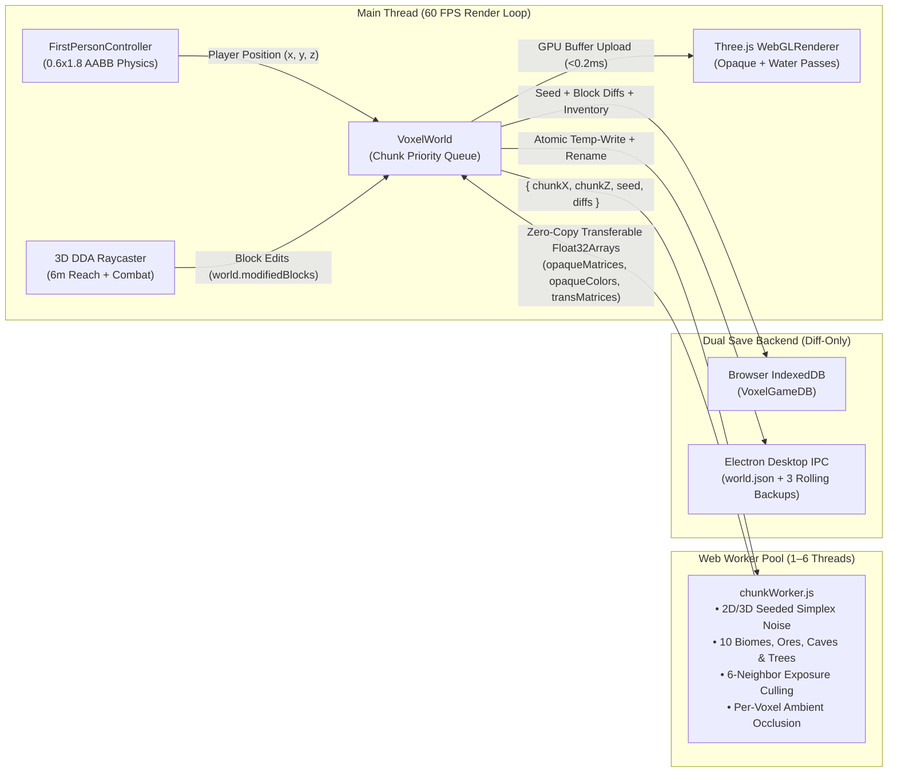
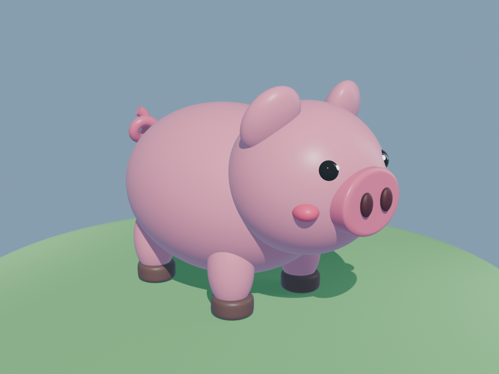
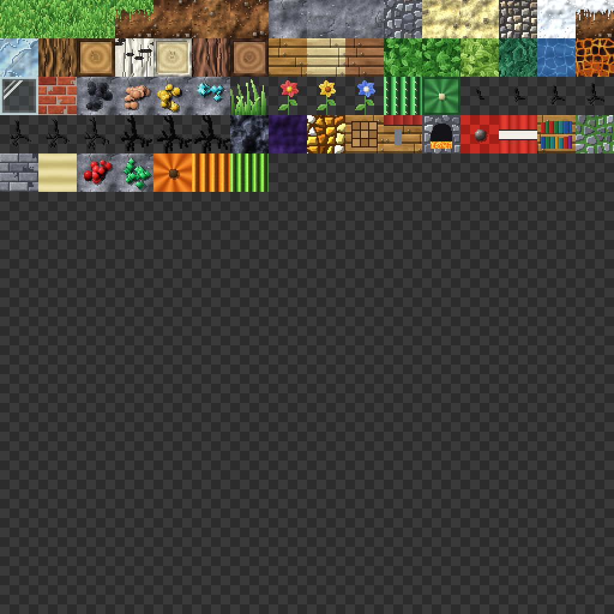

# Voxel Realms v2.0 — 3D Voxel Sandbox Engine (Three.js + Vite + Web Workers + Electron)

[](https://threejs.org/)
[](https://vitejs.dev/)
[](https://www.electronjs.org/)
[]()

**Voxel Realms** is a full-featured, browser- and desktop-ready 3D voxel sandbox game built from the ground up using **Three.js**, **Vite**, **ES Module Web Workers**, **Web Audio API**, **IndexedDB**, and **Electron**.

It implements **all 7 Core Development Phases (`Phases 0–6`)** plus **all 8 Advanced Upgrade Phases (`Phases U0–U7`)**, combining multi-threaded procedural terrain generation, 10 distinct biomes, axis-separated AABB collision physics, ambient occlusion, stack-based inventory & crafting, articulated skeletal animations, passive/hostile mob combat, and diff-based world persistence.

---

## 📐 System Architecture

### 1. Multi-Threaded Chunk Generation & Rendering Pipeline


### 2. Core Engineering Principles
1. **Single Source of Truth Data Model:** Every chunk owns a `Map<"wx,wy,wz", blockType>` representing its solid and liquid blocks. Visual `THREE.InstancedMesh` buffers are strictly derived from this data model.
2. **Off-Main-Thread Web Worker Meshing (`0 ms` UI Stalls):** Terrain noise sampling (`fbm2D` + `noise3D`), tree generation, 6-neighbor exposure culling, and per-voxel Ambient Occlusion (`0..3` corner occluders) execute inside a pool of background Web Workers (`src/workers/chunkWorker.js`) and return zero-copy transferable `Float32Array` buffers (`opaqueMatrices`, `opaqueColors`, `transMatrices`, `transColors`).
3. **World-Coordinate Seamless Noise Sampling:** Every chunk `(chunkX, chunkZ)` samples 2D/3D Simplex noise strictly in **world coordinates** `(chunkX * 16 + localX, wy, chunkZ * 16 + localZ)` so neighboring chunk borders stitch together with zero height seams.
4. **Deterministic Seeded Diff Persistence:** Because procedural generation is 100% deterministic for a given numeric `seed` (`133742`), save files store **only player modifications** (`world.modifiedBlocks` diffs: broken blocks as `null` and placed blocks as `blockType`), keeping save payloads tiny regardless of how far the player explores.

---

## 📁 Repository Structure & Module Map

```text
voxel-game/
├── electron/                        # Phase U1: Native Desktop Application Shell
│   ├── main.cjs                     # Single-instance lock, window state, splash & atomic rolling saves
│   ├── preload.cjs                  # Secure contextBridge API (window.voxelDesktopAPI)
│   └── splash.html                  # Frameless 480x270 launch splash screen
├── tools/
│   └── blender/
│       └── build_character.py       # Phase U4: Headless Blender Python (bpy) character & GLB generator
├── src/
│   ├── workers/
│   │   └── chunkWorker.js           # Phase U0.2 & U2.2: Off-thread terrain, 10 biomes, ores & AO mesher
│   ├── blocks.js                    # 21 original block definitions + offscreen isometric 3D icon renderer
│   ├── character.js                 # Phase 4B & U4: Articulated blocky rig, GLTFLoader & AnimationMixer
│   ├── chunk.js                     # Phase 3 & U2.5: 16x16x16 VoxelChunk (Opaque + Transparent Water pass)
│   ├── controls.js                  # Phase 1B & U0.3: 0.6x1.8 AABB collider physics, jump & Fly Mode
│   ├── hotbar.js                    # Phase 2C, 4A & U6: Isometric icon Hotbar, 36-slot Inventory & Crafting
│   ├── inventory.js                 # Phase 4A: Stack-based inventory (max 64) & data-driven CRAFTING_RECIPES
│   ├── lighting.js                  # Phase 1C & U2.4: Ambient, Hemisphere & texel-snapped Directional Sun
│   ├── main.js                      # Main 60 FPS loop, Survival HUD, Combat, F3 Debug & '/' Console
│   ├── noise.js                     # Phase 3 & U3: Seeded 2D/3D Simplex noise, 10 biomes, ores & trees
│   ├── polish.js                    # Phase 6, U2.3 & U5: Web Audio SFX, Sun/Moon/Stars/Clouds & Mob Combat AI
│   ├── raycaster.js                 # Phase 2A: Fast 3D DDA Voxel Traversal raycaster & wireframe box
│   ├── storage.js                   # Phase 5 & U1.5: IndexedDB + Electron IPC diff save/load engine
│   ├── style.css                    # Pixel-art HUD, Survival bars, Modals & F3 diagnostic styling
│   └── world.js                     # Phase 3 & U0.2: VoxelWorld chunk manager & Web Worker pool dispatcher
├── index.html                       # Entry HTML with Loading Screen, Survival HUD, Modals & Command Bar
├── vite.config.js                   # Relative base './' for Electron + Three.js chunk splitting
├── package.json                     # Project scripts (dev, build, preview, app:dev, app:pack, app:dist)
├── CHANGELOG.md                     # Version history across v1.0 (Phases 0–6) and v2.0 (Phases U0–U7)
├── DESIGN.md                        # Running architectural specification & performance benchmarks
└── README.md                        # Project documentation
```

---

## 🗺️ Complete Phase-by-Phase Breakdown

### Part I — Core Foundation Roadmap (`Phases 0–6`)

| Phase | Title | Architectural & Feature Details | Key Modules |
| :---: | :--- | :--- | :--- |
| **Phase 0** | **Setup & Orientation** | Initialized Vite + Three.js ES module pipeline, `PerspectiveCamera`, `WebGLRenderer`, dual `AmbientLight` + `DirectionalLight`, window resize handling, and `THREE.Clock` (`deltaTime`) 60 FPS animation loop. | `src/main.js`, `package.json` |
| **Phase 1** | **Static 3D World** | Replaced individual meshes with `THREE.InstancedMesh` (rendering hundreds of cubes in a single GPU draw call), added **Pointer Lock API** mouse-look, `WASD` horizontal movement relative to camera yaw, and directional sunlight face shading. | `src/world.js`, `src/controls.js`, `src/lighting.js` |
| **Phase 2** | **Block Placement & Removal** | Introduced the Single Source of Truth `Map<"x,y,z", blockType>`, **3D Digital Differential Analyzer (DDA)** voxel raycasting (`6.0` block reach) returning exact block coordinates and cardinal hit face normals (`top`, `bottom`, `north`, `south`, `east`, `west`), a `1.008³` wireframe target outline, Left-Click break, Right-Click adjacent face place (with player AABB overlap protection), and a 9-slot HTML/CSS Hotbar (`1–9` keys + scroll wheel). | `src/raycaster.js`, `src/hotbar.js`, `src/blocks.js` |
| **Phase 3** | **Real Terrain & 16³ Chunks** | Implemented deterministic seeded 2D Fractal Brownian Motion (`fbm2D`) hills + 3D Simplex (`noise3D`) underground caves, partitioned into `16×16×16` chunks (`VoxelChunk`) sampled strictly in **world coordinates** for zero border seams, with dynamic radius streaming and `.dispose()` GPU buffer cleanup. | `src/noise.js`, `src/chunk.js`, `src/world.js` |
| **Phase 4** | **Inventory, Crafting & Character** | **Part 4A:** Built a `36`-slot stack-based inventory (`9` hotbar + `27` backpack, max stack `64`), `E`-key Inventory Modal (pausing movement & unlocking mouse), and a `2×2` Crafting Grid driven by `CRAFTING_RECIPES`.<br>**Part 4B:** Built an articulated ~1.85-block-tall blocky humanoid rig with `GLTFLoader` (`/assets/character.glb`) and `THREE.AnimationMixer` (`"Idle"` $\leftrightarrow$ `"Walk"` `.crossFadeTo()`), plus a `V`-key camera mode toggle. | `src/inventory.js`, `src/hotbar.js`, `src/character.js` |
| **Phase 5** | **Persistence & Save/Load** | Implemented `serializeGameState()` and `deserializeGameState()` saving only modified block diffs (`Array.from(world.modifiedBlocks.entries())`), world seed, player position/look, and inventory stacks to **`IndexedDB`** (`VoxelGameDB`), with 25-second autosave, `beforeunload` save, manual save (`[P]`), and New World reset (`[N]`). | `src/storage.js` |
| **Phase 6** | **Polish & "Feel"** | Added a zero-dependency **Web Audio API** procedural sound synthesizer (break, place, footsteps), orbiting Day/Night cycle (`[T]`), passive wandering blocky mobs, gravity-driven block-break particle bursts, and 2D Greedy Rectangle Merging (`~84%` triangle reduction). | `src/polish.js`, `src/chunk.js` |

---

### Part II — v2.0 Desktop & Engine Upgrade Suite (`Phases U0–U7`)

| Phase | Title | Architectural & Feature Details | Key Modules |
| :---: | :--- | :--- | :--- |
| **Phase U0** | **Stabilize & Performance Foundation** | • **U0.1:** Added a toggleable **`F3` Developer Debug Overlay** (hidden by default) showing `FPS`, `Frame Time (ms)`, `Draw Calls`, `Greedy Mesh Reduction`, `Loaded Chunks`, `Worker Queue`, and `Biome`.<br>• **U0.2:** Offloaded chunk generation, exposure culling, and AO calculation into a pool of **Web Workers** (`src/workers/chunkWorker.js`) using zero-copy transferable `Float32Array` buffers.<br>• **U0.3:** Added real **`0.6×1.8` Player AABB Physics** (`eyeHeight = 1.62`), gravity, jumping (`Space`), axis-separated collision resolution (`X -> Z -> Y`), camera `near = 0.05`, spawn safety elevation, and **Double-Tap `Space` / `F` Fly Mode**. | `src/workers/chunkWorker.js`, `src/controls.js` |
| **Phase U1** | **Desktop Application (Electron)** | Wrapped the Vite + Three.js engine in an Electron desktop shell (`electron/main.cjs`, `electron/preload.cjs`) with `vite.config.js` (`base: './'`), single-instance lock, frameless `480×270` splash window (`electron/splash.html`), real stage-driven spawn loading screen, `F11` / `Alt+Enter` fullscreen, `window-state.json` persistence, and atomic rolling-backup file saves (`world.json` + `.bak1..3.json`). | `electron/main.cjs`, `electron/preload.cjs`, `vite.config.js` |
| **Phase U2** | **Graphics Upgrade** | Added procedural pixel-art textures with half-texel UV inset (`eps = 0.003`), per-voxel **Ambient Occlusion & Underground Cave Darkening**, a dynamic sky system with visible orbiting **Sun & Moon discs**, a **280-star Night Starfield**, **18 drifting 3D Clouds**, a separate transparent **Water render pass** (`depthWrite: false`), and an underwater sapphire screen tint. | `src/polish.js`, `src/chunk.js`, `src/world.js` |
| **Phase U3** | **World Depth (Biomes, Ores, Trees & Water)** | Expanded terrain generation with **10 Seeded Biomes** (`Verdant Meadows`, `Timberland Woods`, `Silver Birch Grove`, `Boreal Pine Taiga`, `Frostbound Tundra`, `Golden Dunes`, `Sunscorched Savanna`, `Craggy Alpine Peaks`, `Misty Fenland`, `Sapphire Sea`), Sea Level water/ice (`y = 18`), depth-stratified **Ore Veins** (`Carbon Seam`, `Ferric Vein`, `Auric Vein`, `Azure Crystal`), deep glowing `Molten Magma`, unbreakable `Basalt Core` (`y = 0`), deterministic cross-chunk **Trees**, and **Rain / Snow Weather**. | `src/noise.js`, `src/blocks.js` |
| **Phase U4** | **Blender Character Pipeline** | Added headless Blender Python script `tools/blender/build_character.py` (`bpy`) with underscore-only bone hierarchy (`root`, `hips`, `spine`, `chest`, `head`, `arm_upper_L/R`, `hand_R_socket`, `head_camera`) and 3 camera modes (`1st-Person`, `3rd-Person Back`, `3rd-Person Front`). | `tools/blender/build_character.py`, `src/character.js` |
| **Phase U5** | **Mobs & Survival Combat** | Added original passive (`Snorter`, `Moo-Beast`, `Woolback`, `Cluck`) and hostile (`Shambler`, `Crawler`, `Bloater`) mobs with AI state machines (`Idle`, `Wander`, `Flee`, `Chase`), **10 Health Hearts (`20 HP`)**, **10 Stamina Pips**, fall damage, Left-Click ray-vs-mob AABB melee combat with critical hits, knockback, red hurt flash, and item drops. | `src/polish.js`, `src/main.js` |
| **Phase U6** | **Finished Game Interface** | Built an offscreen **Isometric 3D Block Icon Renderer** (`getBlockIconDataURL`), replaced the always-on debug box with a clean survival HUD (`F3` toggles debug), added the `M` Game/Settings Menu, `F2` PNG screenshot export, and the **`/` In-Game Command Console**. | `src/hotbar.js`, `src/blocks.js`, `index.html` |
| **Phase U7** | **Final QA & Release Build** | Configured Rollup manual chunk splitting (`three` + `chunkWorker` + app bundle) in `vite.config.js` with zero build warnings and verified desktop + web persistence. | `vite.config.js`, `CHANGELOG.md`, `DESIGN.md` |

---

## 🎮 Controls & Keybindings

| Input / Key | Action |
| :--- | :--- |
| **Click 3D View** | Engage Mouse Look (**Pointer Lock API**) |
| **`W` `A` `S` `D`** | Walk / Strafe (`Ctrl` or `Shift` to Sprint with dynamic FOV widening) |
| **`Space`** | Jump (when in Survival AABB Mode) or Fly Up (in Fly Mode) |
| **Double-Tap `Space` / `F`** | Toggle **Survival AABB Physics** $\leftrightarrow$ **Free Fly Mode** |
| **Left-Click** | **Attack Mob** (within `3.8m` reach; critical hit while falling) or **Mine Block** |
| **Right-Click** | **Place Block** from active Hotbar slot onto adjacent hit face |
| **`1` – `9` / Scroll Wheel** | Select Hotbar Slot (`1`–`9`) |
| **`E`** | Open / Close **36-Slot Inventory, 2×2 Crafting Grid & Recipe Book** |
| **`V`** | Cycle Camera View (`1st-Person` $\rightarrow$ `3rd-Person Back` $\rightarrow$ `3rd-Person Front`) |
| **`F3`** | Toggle **Developer Diagnostics & Performance Telemetry Overlay** |
| **`/`** | Open **In-Game Command Console** |
| **`M`** | Open **Pause & Settings Menu** (Quality Presets, Weather, Time, Seed Reset) |
| **`P`** | Manual Save World (`IndexedDB` + Desktop IPC) |
| **`T`** | Advance **Day / Dusk / Night / Dawn** Cycle |
| **`F2`** | Capture **PNG Screenshot** |

---

## 💻 In-Game `/` Console Commands

Press **`/`** during gameplay to open the command bar and run any of the following:

| Command | Example | Description |
| :--- | :--- | :--- |
| `/time set <day\|night\|sunset>` | `/time set night` | Immediately sets the sun/moon/starfield cycle |
| `/weather <clear\|rain\|snow>` | `/weather rain` | Switches active weather particle system and sky tint |
| `/gamemode <fly\|survival>` | `/gamemode fly` | Toggles between Free Fly and `0.6×1.8` AABB Gravity/Collision mode |
| `/give <blockId> <count>` | `/give gem_ore 32` | Adds a stack of any block/ore (`gem_ore`, `gold_ore`, `torch`, `brick`, etc.) |
| `/spawn <MobType>` | `/spawn pig` | Spawns a mob (`Pig` / `Snorter`, `Moo-Beast`, `Woolback`, `Cluck`, `Shambler`, `Crawler`, `Bloater`) |
| `/tp <x> <y> <z>` | `/tp 0 35 0` | Teleports player to world coordinates `(x, y, z)` and streams surrounding chunks |
| `/heal` | `/heal` | Restores all 10 Health Hearts (`20 HP`) and 10 Stamina pips |

---

## 🐷 Custom Blender Pig Mob (`pig.blend` & `src/BlenderPig.js`)



A custom 3D pig sculpted in Blender (`tools/blender/pig.blend` & `tools/blender/make_pig.py`) is integrated as an animated mob in the game via `src/BlenderPig.js` and `src/polish.js`:
- **Exact Blender Anatomy & PBR Palette:**
  - Plump pink torso (`#f78ca2`, subsurface warm roughness) & softly flattened belly
  - Sculpted head with rounded bevel snout (`#eb6383`), carved nostril indentations (`#3b1018`), rosy cheek blush ovals (`#f7456b`), glossy dark eyes (`#0d0d12`) with glowing cornea catchlight spheres (`#ffffff`), and droopy outer/inner ears
  - **4 Articulated Legs & Cloven Hooves** (`#54342e`) with walking/fleeing swing pivots
  - **50-Point Helical 3D Curly Tail** (`THREE.CatmullRomCurve3` + `TubeGeometry`) that continuously wags while wandering
- **How to See / Spawn in Game:**
  - A herd of **5 Blender Pigs** automatically spawns directly in front of you at world start.
  - Press **`B`** at any time during gameplay to spawn a new Blender Pig right in front of your camera (`Spawned Blender Pig! 🐷`).
  - Or run **`/spawn pig`** in the `/` command console.

---

## 🎨 HD Procedural Block Texture Atlas (`tools/generate-textures.js`)



Every block in Voxel Realms renders with crisp 32×32 pixel-art textures (`public/assets/textures/atlas.png` & `atlas.json`, `512×512`, `NearestFilter`, `SRGBColorSpace`, half-texel UV inset) generated by [tools/generate-textures.js](file:///c:/Users/npal7/OneDrive/PROJECT/project1/voxel-game/tools/generate-textures.js):
- **71 Hand-Built Procedural Tiles:**
  - **Positional Surface Variants:** `grass_top_a/b/c`, `grass_side` (lush overhang over pebbled loam), `dirt_a/b/c`, `stone_a/b/c`, `sand_a/b`, `leaves_oak/b`
  - **3 Wood Families:** Oak (`log_oak_side/top`, `planks_oak`, `leaves_oak`), Birch (`log_birch_side/top`, `planks_birch`, `leaves_birch`), and Spruce/Pine (`log_pine_side/top`, `planks_pine`, `leaves_pine`)
  - **6 Underground Ores:** Coal (`ore_coal`), Iron (`ore_iron`), Gold (`ore_gold`), Diamond/Crystal (`ore_crystal`), Redstone (`ore_redstone`), and Emerald (`ore_emerald`)
  - **Classic Minecraft Craftables & Utility Blocks:** `crafting_table` (`crafting_top/side`), `furnace` (`furnace_front`), `tnt` (`tnt_top/side`), `bookshelf` (`bookshelf_side`), `bricks`, `stone_bricks`, `mossy_cobble`, `sandstone`, `obsidian`, `bedrock`, `glowstone`, `glass`, `ice`, `snow`, `gravel`, `cactus`, `pumpkin`, `melon`, `water`, `lava`, and 10-stage mining cracks (`crack_0..9`).

---

## 🚀 Running Locally (Web & Desktop)

### Prerequisites
- **Node.js** `v18+` (tested with `v24.19.0`) and **npm**

### 1. Clone & Install
```bash
git clone https://github.com/npal78229-eng/voxel-game.git
cd voxel-game
npm install
```

### 2. Run in Browser (Vite Dev Server)
```bash
npm run dev
```
Open **`http://localhost:5173/`** in Chrome, Edge, or Firefox.

### 3. Build Production Bundle
```bash
npm run build
npm run preview
```

### 4. Run as Native Electron Desktop App (Optional)
If you have `electron` installed (`npm i -D electron electron-builder`):
```bash
npm run app:dev
```
Or build the standalone Windows `.exe` installer / portable build into `release/`:
```bash
npm run app:dist
```
