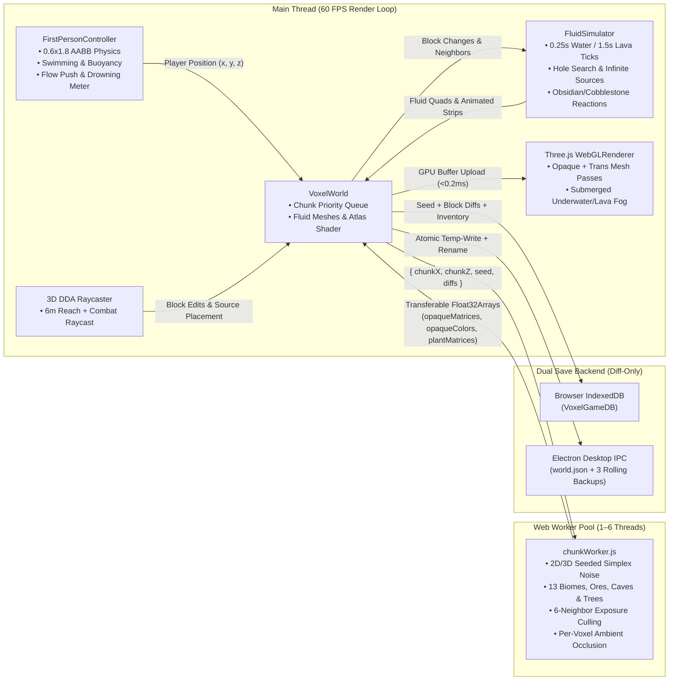
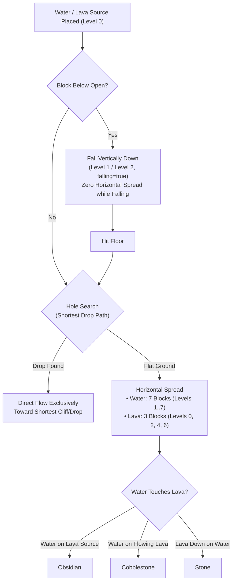
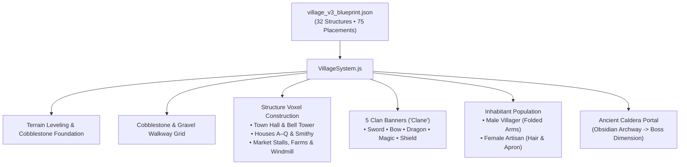
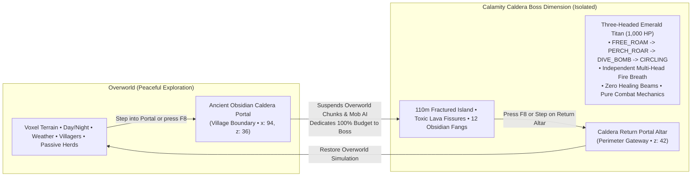
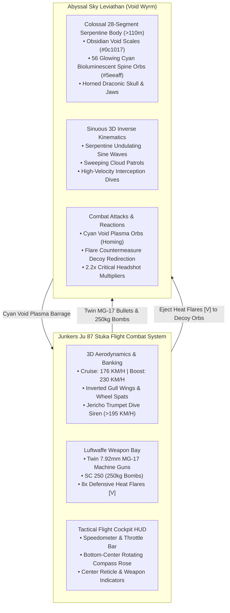
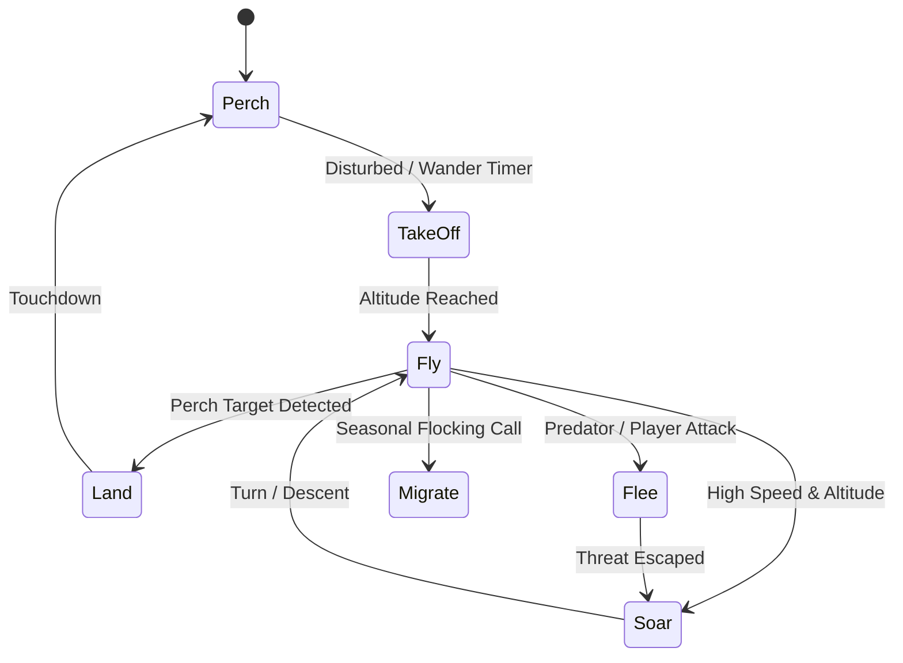
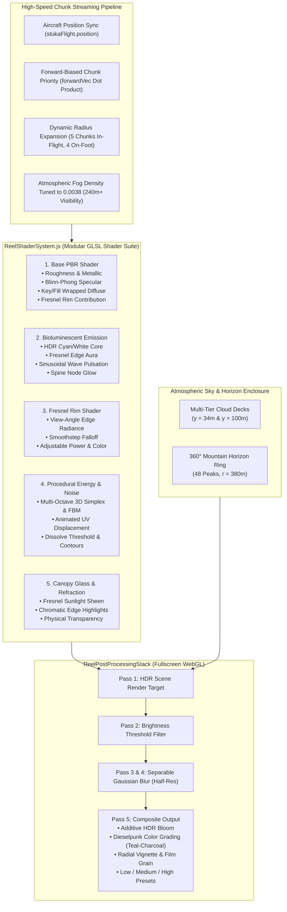

# Voxel Realms v2.0 — 3D Voxel Sandbox Engine (Three.js + Vite + Web Workers + Electron)

[](https://threejs.org/)
[](https://vitejs.dev/)
[](https://www.electronjs.org/)
[]()
[]()
[]()
[]()
[]()
[]()
[]()
[]()
[]()
[]()

**Voxel Realms** is a full-featured, browser- and desktop-ready 3D voxel sandbox game built from the ground up using **Three.js**, **Vite**, **ES Module Web Workers**, **Web Audio API**, **IndexedDB**, and **Electron**.

It implements **all 7 Core Development Phases (`Phases 0–6`)**, **all 8 Advanced Upgrade Phases (`Phases U0–U7`)**, the **Village v3 Procedural Architecture & 5 Clan Territories**, the **Calamity Caldera Three-Headed Titan Boss Dimension**, the **Minecraft-Style Fluid Physics Simulator**, **13 Procedural Biomes & Old-Growth Forests**, **Multi-Attack Combat AI**, **20-Day 4-Season Climate Engine**, **Reynolds Boids 3D Flying Birds**, and **16 Sculpted Blender Mobs & Villagers**.

---

## 📐 System Architecture

### 1. Multi-Threaded Chunk Generation & Rendering Pipeline


### 2. Core Engineering Principles
1. **Single Source of Truth Data Model:** Every chunk owns a `Map<"wx,wy,wz", blockType>` representing its solid and transparent voxels, and a dedicated `fluids` map for simulated water and lava flow. Visual meshes are strictly derived from this state.
2. **Off-Main-Thread Web Worker Meshing (`0 ms` UI Stalls):** Terrain noise sampling (`fbm2D` + `noise3D`), tree generation, 6-neighbor exposure culling, and per-voxel Ambient Occlusion execute inside a pool of background Web Workers (`src/workers/chunkWorker.js`) using zero-copy transferable `Float32Array` buffers.
4. **Deterministic Seeded Diff Persistence:** Natural terrain and settled water generate deterministically from the numeric seed (`133742`). Save files store **only player modifications** (`world.modifiedBlocks` diffs: broken blocks as `null` and placed blocks as `blockType`), keeping save payloads tiny regardless of world exploration distance.

---

## 📁 Repository Structure & Module Map

```text
voxel-game/
├── electron/                        # Native Desktop Application Shell
│   ├── main.cjs                     # Single-instance lock, window state, splash & atomic rolling saves
│   ├── preload.cjs                  # Secure contextBridge API (window.voxelDesktopAPI)
│   └── splash.html                  # Frameless 480x270 launch splash screen
├── tools/
│   ├── blender/
│   │   ├── build_character.py       # Articulated blocky character & animations generator (bpy)
│   │   ├── build_water.py           # Procedural water block, shape keys & wave exporter (bpy)
│   │   ├── generate_all_mobs.py     # Headless 14-mob suite generator (bpy)
│   │   ├── all_mobs.blend           # Daytime, companion & feral mob models
│   │   └── night_horror_mobs.blend  # Night horror combatant models
│   └── generate-textures.js         # 102-tile outline-free seamless texture atlas generator
├── src/
│   ├── ai/
│   │   └── BirdFlightAI.js          # Real 3D bird flight finite state machine & Reynolds boids flocking
│   ├── climate/
│   │   ├── ClimateSystem.js         # 20-day 4-season cycle, temperature model, weather state machine & shader uniforms
│   │   └── AnimalClimateBehavior.js # Staggered climate behavior (Shelter, Rest, Drink, Huddle, Sleep) & flutter fall
│   ├── combat/
│   │   ├── AttackController.js      # Multi-attack cooldown tracker with 0.8s global recovery delay
│   │   ├── AttackRange.js           # Line-of-sight & swept distance boundary verifier
│   │   └── attacks/
│   │       ├── MeleeAttack.js       # Scythe slash & claw attack logic
│   │       ├── RangedMagicAttack.js # High-velocity swept magic projectiles
│   │       └── SoulBeamAttack.js    # Channeled 50% HP non-lethal soul drain beam
│   ├── config/
│   │   ├── animalClimate.js         # Animal climate thresholds, huddle radiuses & sleep schedules
│   │   ├── animals.js               # Centralized animal spawn groups (1..4) and nearby density caps (max 4 within 32m)
│   │   ├── blocks.js                # Block properties, transparent flags, hardness & drops
│   │   ├── caves.js                 # 3D Simplex cave thresholds & worm tunnels
│   │   ├── climate.js               # Season calendar, day-length shifts, weather transition matrix
│   │   ├── fluids.js                # Fluid viscosity, tick rates, spread limits & thermic reactions
│   │   ├── lightning.js             # Strike frequencies (8..20s / 90..180s) and target weights (30/60/80)
│   │   ├── mobs.js                  # Mob stats, reaction behavior, panic multipliers & hitboxes
│   │   ├── ores.js                  # Depth-stratified ore vein distribution
│   │   ├── spawning.js              # Mob population caps & spawn weightings
│   │   ├── time.js                  # 20-minute master day/night cycle & normalized cycle boundaries
│   │   └── trees.js                 # Dark Oak (2x2), Autumn Maple & Giant Redwood (40m) procedural models
│   ├── fluids/
│   │   ├── FluidSimulator.js        # Discrete cellular automaton water & lava spread engine
│   │   ├── FluidMesher.js           # Dynamic quad mesher with 4-corner height interpolation & animated strips
│   │   └── WaterRenderer.js         # Minecraft shader material, surface waves, flow UVs & animation loop
│   ├── weather/
│   │   └── Lightning.js             # Natural lightning simulator, 3D visual bolt, delayed audio & terrain charring
│   ├── workers/
│   │   └── chunkWorker.js           # Multi-threaded terrain noise, 13 biomes, exposure culling & AO
│   ├── BlenderMobs.js               # Articulated 3D mob rigs, procedural animation mixers & limb kinematics
│   ├── blocks.js                    # Block registrations, UV coordinates & isometric icon renderer
│   ├── character.js                 # Humanoid character rig & 3 camera modes (1st/3rd person)
│   ├── chunk.js                     # VoxelChunk container (opaque, cross-plants, transparent water)
│   ├── collision.js                 # 0.6x1.8 AABB collision solver with axis-separated step resolution
│   ├── controls.js                  # FirstPersonController, buoyancy, swimming, drowning & fly mode
│   ├── daylightBurn.js              # Open-sky daylight burn raycasting & shade detection
│   ├── DragonArenaSystem.js         # Calamity Caldera dimension, Three-Headed Titan boss & obsidian altar
│   ├── hotbar.js                    # 9-slot Hotbar, 36-slot Inventory & 2x2 Crafting Grid
│   ├── inventory.js                 # Stack-based item storage (max 64) & crafting recipes
│   ├── lighting.js                  # Sun/moon directional light with texel-snapped shadow mapping
│   ├── main.js                      # 60 FPS loop, HUD, oxygen meter, screen tints, F3 telemetry & console
│   ├── mobAttacks.js                # Mob melee hitboxes, critical falls, knockback & item drops
│   ├── noise.js                     # Seeded 2D/3D Simplex noise, 13 biomes, forest ground details & trees
│   ├── polish.js                    # Web Audio SFX, atmospheric soundscapes, fireflies, sun/moon/stars & mobs
│   ├── projectiles.js               # Magic projectile pool & swept collision testing
│   ├── raycaster.js                 # 3D DDA voxel traversal raycaster & wireframe selection box
│   ├── SkyLeviathan.js              # Colossal 28-segment Void Leviathan wyrm with dual-track glowing cyan orbs & combat AI
│   ├── statusEffects.js             # Player status effects (Poison, Bleed, Stagger, Fear, Weakness, Soul Drain)
│   ├── storage.js                   # IndexedDB & Electron IPC diff persistence engine
│   ├── StukaFlightSystem.js         # Authentic Stuka Ju 87 flight simulator, 7.92mm MG-17s, bombs, sirens & tactical HUD
│   └── world.js                     # Chunk manager, Web Worker dispatcher & fluid simulation coordinator
```

---

## 🌊 Minecraft-Style Fluid Physics Simulation (`src/fluids/`)

Voxel Realms features a faithful, high-performance fluid simulation reproducing Minecraft's liquid mechanics:



### 1. Simulation Rules & Reactions
- **Water Behavior:** 0.25s tick delay; spreads horizontally up to 7 blocks (levels 1–7); drops by 1 level per block; 4-block hole search pathfinding.
- **Lava Behavior:** 1.5s tick delay (slower, viscous); spreads up to 3 blocks (levels 0, 2, 4, 6); drops by 2 levels per block; 2-block hole search pathfinding.
- **Infinite Water Sources:** Formed whenever an empty block has 2+ horizontally adjacent water sources over a solid or source floor.
- **Flow Retreat:** When a source block is removed, flowing liquid retreats and clears cleanly without leaving orphan fluid blocks.
- **Solid Block Displacement:** Placing any solid block directly into a fluid cell completely displaces and unregisters the fluid, scheduling only valid fluid neighbors to retreat without phantom spawns.
- **Dry Land Block Placement & Removal:** Block editing on dry land is completely isolated from fluid simulation routines, ensuring 0 unintended fluid generation.
- **Thermal Block Reactions:**
  - Water flowing horizontally over a Lava Source $\rightarrow$ **Obsidian**.
  - Water touching Flowing Lava $\rightarrow$ **Cobblestone**.
  - Lava falling vertically onto Water $\rightarrow$ **Stone**.

### 2. Variable-Height Quad Meshing, Plant Isolation & Water Shaders (`src/fluids/`)
- **Variable Quad Heights:** Fluid surface height is calculated per corner using the Minecraft formula:
  $$h = \frac{8 - \text{level}}{9.0}$$
  (Falling columns and source blocks with fluid above render at a full height of `1.0`).
- **Smooth 4-Corner Averaging:** Each vertex height is averaged across adjacent fluid blocks to generate smooth downward slopes.
- **Plant Mesh Isolation (`src/chunk.js`):** Foliage and undergrowth plants (`tall_grass_plant`, `flower_bluebell`, `flower_violet`, `fern`, etc.) are rendered via a dedicated double-sided cross-plane mesh (`plantMesh` with `sharedPlantMaterial`). Transparent blocks (glass, ice) use a separate atlas material (`sharedTransparentMaterial`), ensuring plants never morph into animated water cubes during dynamic chunk remeshing.
- **Enhanced Minecraft-Style Water Shader (`src/fluids/WaterRenderer.js`):** Custom vertex displacement waves (`uWaveAmplitude`, `uWaveSpeed`), UV flow scrolling (`uFlowSpeed`), dynamic depth alpha, and animated surface sparkles.
- **Animated 16-Frame Strips:** Real-time 10 Hz texture frame animation cycling 16 frames on 32×512 vertical strips for `water_still.png`, `water_flow.png`, `lava_still.png`, and `lava_flow.png`.

### 3. Entity Buoyancy, Swimming & Drowning Physics (`src/controls.js`)
- **Water Swimming:** Holding `Space` swims upward at **3.5 m/s**; sinking is clamped to a **2.0 m/s** terminal velocity; horizontal speed is damped to **0.5×** (or **0.72×** while sprinting).
- **Fall Damage Negation:** Entering water or lava instantly clears accumulated fall distance (`highestAirY = playerPosition.y`).
- **Fire & Lava Damage:** Lava deals **4 HP damage every 0.5s**; swimming in lava is clamped to **1.5 m/s** upward and **1.0 m/s** sink; exiting lava inflicts a **15-second fire burn** (1 HP/s). Stepping into water immediately extinguishes burning fire.
- **Fluid Flow Push Force:** Downward drag in falling fluid columns (**3.2 m/s**) and horizontal pushing downstream along surface gradients (**1.8 m/s**).
- **Oxygen & Drowning Meter:** Submerging the player's head depletes an air supply lasting **15.0 seconds** (represented by 10 animated bubbles on `#oxygen-bar`); running out of oxygen deals **2.0 DPS drowning damage**; oxygen refills at **5 bubbles/second** upon surfacing.
- **Camera Screen Tints & Fog:** Submerging into water applies a cyan screen tint and sapphire fog (`#1d4ed8`, density `0.065`); submerging into lava applies an orange-red screen tint and dense orange fog (`#ea580c`, density `0.40`).

---

## ⚔️ Night Mob Multi-Attack Combat & Status Effects (`src/combat/`)

Voxel Realms features a tactical 3-phase melee combat engine and specialized data-driven multi-attack bosses:

### 1. GrimWraith 3-Attack Combatant
The **GrimWraith** uses a dedicated [`AttackController`](file:///c:/Users/npal7/OneDrive/PROJECT/project1/voxel-game/src/combat/AttackController.js) with independent cooldowns and a 0.8s global recovery delay:
1. **Scythe Slash:** Fast melee slash dealing **4 damage** with **0.75 knockback** within 3.5m.
2. **Summon Skeletons:** Raises arms to summon up to **3 Bonewalker Skeletons** (`SoulSkeleton`), capped to prevent endless swarms.
3. **Soul Steal (`SoulBeamAttack`):** Long-range channeled soul beam dealing **50% of the player's current health** (non-lethal, leaving at least 1 HP); strictly blocked by solid block cover in line-of-sight.

### 2. SoulSkeleton Minion
- Fully articulated blocky skeleton with glowing teal soul core.
- Executes **Claw Scratch** (2 damage, 1.6m range).
- Burns in open daylight (4.0 DPS) and seeks shade/water.
- **Crumble Mechanic:** When the parent GrimWraith is slain, all summoned skeletons instantly collapse and crumble into dust.

### 3. Player Status Effects (`src/statusEffects.js`)
- **Poison:** Deals 1 damage every 1.5s; non-lethal (stops at 1 HP).
- **Bleed:** Deals 1 damage every 1.0s; lethal.
- **Stagger:** Locks player attacks and sprinting for 0.8s, followed by **3.0 seconds of stagger immunity**.
- **Fear:** Slows movement speed by 40% and produces screen shake.
- **Weakness:** Reduces player melee attack damage by 40%.
- **Soul Drain:** Drains 10% maximum health over time and depletes stamina.

---

## 🏰 Village v3, Clan Territories & Villagers (`src/world/VillageSystem.js`)

Voxel Realms introduces a full procedural architectural generation system powered by `village_v3_blueprint.json` and customized Blender assets, featuring an authentic living settlement:



### 1. Village Architecture & Blueprint Specification
- **32 Structural Typologies:** Town Hall (`footprint: [11, 9]`), Bell Tower (`footprint: [5, 5]`), Smithy with furnaces and crafting tables, Central Village Well, Market Stalls (NW, NE, SW, SE), 16 Residential Houses (`house_a` through `house_q`), 2 Agricultural Crop Farms, Windmill, and Clan House.
- **75 Deterministic Placements:** Full $104 \times 72$ block settlement layout. Each placement specifies structure type, grid offsets $(x, z)$, and $90^\circ$ clockwise rotation index ($r \in \{0, 1, 2, 3\}$).
- **Adaptive Ground Foundation:** Generates supportive cobblestone underpinnings down to solid terrain so buildings never float on undulating or sloped topography.
- **Thoroughfares & Plazas:** Automated cobblestone and gravel pathways connecting the central well, market square, residential quarters, and the outer clan boundary.

### 2. The 5 Clan Banners ("Clane")
At the eastern edge of the settlement stands the Clan District, featuring 5 monumental banner posts marking the territories of the realm's great factions:
| Clan | Emblem & Colors | Insignia Meaning | Position in Village |
| :--- | :--- | :--- | :--- |
| ⚔️ **Sword** | Crimson banner (`#b91c1c`) with Gold core (`#f59e0b`) | Clan of the Blade — Frontline warrior vanguard | $(x: 85, z: 29)$ |
| 🏹 **Bow** | Azure banner (`#0284c7`) with Sky-Blue trim (`#38bdf8`) | Clan of the Gale — Marksmen and scouts | $(x: 88, z: 26)$ |
| 🐉 **Dragon** | Emerald banner (`#15803d`) with Jade crest (`#4ade80`) | Clan of the Wyrm — Keepers of the ancient caldera lore | $(x: 85, z: 23)$ |
| 🔮 **Magic** | Amethyst banner (`#7e22ce`) with Glowing Violet rune (`#c084fc`) | Clan of the Arcane — Mystics and enchanters | $(x: 88, z: 20)$ |
| 🛡️ **Shield** | Slate Cobalt banner (`#334155`) with Steel plate (`#94a3b8`) | Clan of the Aegis — Protectors and builders | $(x: 85, z: 17)$ |

Each flag is constructed with a 5-block tall spruce log pole (`pine_log`), a golden finial (`gold_ore`), a crown torch, and high-detail double-sided 3D cloth banners with procedural wind oscillation.

### 3. Living Villager Fauna (`src/BlenderMobs.js`, `src/config/mobs.js`)
Modeled after `minecraft_villagers.blend` and translated into optimized voxel rigs:
- **Classic Villager (`Villager`):** Iconic folded-arms posture (`Villager_FoldedArms_Middle`), emerald belt buckle, brown wool robe, unibrow, and long protruding nose.
- **Artisan Villager (`VillagerFemale`):** Dual side hair braids, collar trim, and an artisan teal apron.
- **Interactive Head-Turn Tracking:** When the player approaches within 6 meters, villagers smoothly turn their heads to maintain eye contact with the player.
- **Behavior Class:** Passive entities (20 HP) that panic when harmed, emit emerald ore rewards upon defeat, and wander peacefully around market stalls and plazas.

---

## 🐉 Calamity Caldera & Three-Headed Emerald Titan Boss Dimension (`src/DragonArenaSystem.js`)

The **Three-Headed Emerald Titan** is a monumental boss encounter strictly quarantined inside its own dedicated spatial dimension:



### 1. Laptop Performance Isolation Architecture
To guarantee smooth **60+ FPS performance on everyday laptops** (tested on Core i5-10200H + GTX 1650):
- **Overworld Suspension:** Stepping through the Ancient Portal immediately suspends heavy Overworld background jobs: chunk worker meshing, infinite chunk generation, dynamic daylight calculations, weather particles, lightning simulations, and passive animal herd ticks.
- **Zero Dragon Presence in Overworld:** The Three-Headed Dragon **never spawns in the Overworld**, preventing world disruption and saving GPU/CPU memory for normal gameplay.
- **Single-Focused Frame Budget:** 100% of the GPU draw calls and CPU frame budget in the Boss Dimension are dedicated solely to the dragon's multi-head animations, flapping wings, toxic lava fissures, and retaliatory combat.

### 2. Calamity Caldera Environment Design
- **110-Meter Fractured Continent:** Formed from deepslate, basalt, and bedrock with zero edge barriers for high-stakes aerial combat.
- **Toxic Green Lava Fissures:** 8 radial tectonic rifts filled with radiant emerald magma (`#39ff14`) dealing thermal hazard damage.
- **12 Obsidian Caldera Fangs:** Monolithic needle crags (up to 12m tall) flanking the caldera perimeter, serving as tactical cover against breath attacks.
- **Wyrm's Throne Crag:** Central elevated altar where the Titan lands during perched roar phases.
- **Atmospheric Lighting:** Self-contained ambient emerald glow, dramatic green moonlight (`#55ff77`), and 50 floating animated toxic embers.
- **Zero Crystal Healing Beams:** Unlike the vanilla Ender Dragon fight, all healing beams have been eliminated for a pure, responsive combat test.

### 3. Boss Artificial Intelligence & Retaliatory State Machine
The Titan is endowed with neutral **Free Will**:
- **`FREE_ROAM` (Neutral State):** The dragon glides peacefully in high atmospheric circles ($r = 32\text{m}$, altitude $16\text{m}$) over the caldera. It ignores the player unless provoked.
- **`PERCH_ROAR`:** Glides down to perch atop the Wyrm's Throne, spreading its wings and charging fire cores across all three heads.
- **Retaliation Trigger:** Attacking the dragon immediately triggers aggro, shifting the boss into aggressive combat phases:
  - **`DIVE_BOMB`:** Sweeps down at high velocity directly toward the player's position.
  - **`RETALIATE_CIRCLING`:** Executes tight strafing maneuvers ($r = 24\text{m}$) while firing green toxic fire bursts from all three roaring heads.
- **Dynamic Boss Health Bar HUD:** Real-time top-screen health bar display showing the Titan's remaining vitality out of 1,000 HP and current combat status.
- **Exiting the Dimension:** Players can return to the Overworld village at any time by stepping into the Caldera Return Portal at the perimeter, or by pressing **`F8`** or entering `/dragon`.

---

## ✈️ Instagram Reel Dogfight Recreation: Stuka Ju 87 vs Abyssal Sky Leviathan (`src/StukaFlightSystem.js`, `src/SkyLeviathan.js`)

Directly recreated from the viral aerial combat showcase (**Instagram: `@cloudgamesid` / user `IQBALISM`**), this mode delivers an authentic, high-octane 3D aerial dogfight against a colossal serpentine leviathan high in the cloudy overcast heavens.



### 1. Colossal Abyssal Sky Leviathan / Void Wyrm (`src/SkyLeviathan.js`)
- **Colossal 28-Segment Serpentine Anatomy:** Measures over **110 meters in length**, articulating in real-time through distance constraints and mathematical serpentine sine-wave undulations.
- **Deep Obsidian & Charcoal Texture:** High-contrast dark void scales (`#0c1017`) and charcoal dorsal plates (`#161c26`), matching the gloomy atmospheric aesthetic of the reel.
- **Iconic Dual-Track Cyan Bioluminescent Orbs:** Symmetrically placed along both the left and right flanks of its spine across all 28 body segments (56 glowing nodes in total, `#5eeaff` with white cores `#ffffff`), which pulse rhythmically as the beast glides through overcast skies.
- **Horned Dragon Skull & Jaw:** Articulated lower jaw that drops open during dives, sweeping obsidian horns, ivory teeth, glowing cyan eyes, and an internal plasma core.
- **Homing Void Plasma Orbs & Flare Decoys:** Fires volleys of homing cyan plasma projectiles. When the player deploys Stuka heat flares (`[V]`), the plasma orbs track the flares instead, safely detonating away from the aircraft.
- **Ballistics & Hit Detection:** All 28 body segments and the head feature 3D spherical hitboxes. Machine gun bullets inflict continuous damage, headshots score **2.2× critical multipliers**, and 250kg bombs cause devastating area explosions (150 damage).

### 2. Junkers Ju 87 Stuka Flight Combat Mechanics (`src/StukaFlightSystem.js`)
- **Procedural 3D Stuka Model:** Built with authentic Luftwaffe camouflage (`#2e3b2e`), Hellblau underside (`#768896`), eastern-front yellow cowling accents (`#d4a017`), inverted gull wings, wheel spats, transparent greenhouse canopy, and spinning propeller.
- **Flight Physics & Control Feel:**
  - **Cruise Airspeed:** 176 KM/H (matching the exact dial readout in the reel).
  - **Engine Boost:** Press **`Space`** to engage emergency boost up to 230 KM/H.
  - **Dive Brakes:** Hold **`Shift`** to deploy airbrakes and slow to 115 KM/H for precision bombing.
  - **Pitch, Roll & Yaw:** Responsive mouse and WASD navigation with natural banking roll stabilization.
- **Twin 7.92mm MG-17 Machine Guns:** High-velocity raycast ballistic tracers with muzzle flashes and synthesized cyclic firing rattle.
- **SC 250 Dive Bomb Drop:** Gravity-affected 250kg aerial bomb with ballistic trajectory and ground/boss detonation.
- **Defensive Heat Flares (`[V]`):** Ejects sparkling pyrotechnic countermeasure clusters that draw away homing plasma orbs.
- **Jericho Trumpet Dive Siren:** Dynamically activates via Web Audio API during steep dives exceeding 195 KM/H with authentic acoustic pitch ramp.
- **Tactical Flight Cockpit HUD:** Bottom-center rotating compass rose dial with needle, player heart display, left-hand `176 KM/H` digital speedometer and throttle gauge, and center flight reticle with ammunition status.

### 3. Activating Stuka Flight Mode
- **From Launcher:** Select the **`✈️ Sky Leviathan: Stuka Dogfight`** expedition card and click **START EXPEDITION**.
- **In-Game Hotkey:** Press **`F7`** at any time to instantly mount/dismount the Stuka dive bomber.
- **Console Commands:** Type **`/stuka`** to toggle flight mode, or **`/leviathan`** to summon the colossal wyrm into the overcast sky.

---

## ⚙️ Mob Simulation, Pathfinding & Chunk Alignment Mechanisms (`src/polish.js`, `src/collision.js`)

To resolve mob freezing, clipping, and spawning issues, the simulation engine implements robust chunk synchronization and recovery mechanisms:

### 1. Active Chunk-Load Surface Alignment
- **The Problem:** In infinite streaming worlds, mobs initialized before asynchronous Web Worker chunk meshing finishes would often have their vertical position set to pre-mesh noise estimates. When actual terrain voxels streamed in, mobs could become embedded inside solid dirt, stone hillsides, or dense tree foliage.
- **The Solution:** Whenever an entity transitions from an unloaded chunk to a loaded chunk, [`polish.js`](file:///c:/Users/npal7/OneDrive/PROJECT/project1/voxel-game/src/polish.js) invokes [`getHighestSolidY`](file:///c:/Users/npal7/OneDrive/PROJECT/project1/voxel-game/src/collision.js) against the real chunk voxel map. If the mob's foot elevation is below the true ground level, it is immediately elevated to `groundY + 0.5`, zeroing vertical velocity and grounding the entity cleanly.

### 2. Immediate Collision Push-Out vs 4-Stage Stuck Ladder
- **Frame-by-Frame Intersect Detection:** If an entity's AABB (`0.65×1.2` or `0.85×1.95`) intersects any solid voxel, [`pushEntityOutOfBlocks`](file:///c:/Users/npal7/OneDrive/PROJECT/project1/voxel-game/src/collision.js) immediately attempts cardinal nudges ($0.85\text{m}$) or vertical upward lifts to find clear air space.
- **4-Stage Stuck Ladder (at 2 Hz):**
  - *Stage 1 (0.5s–1.2s):* Auto-jump impulse (`AUTO_JUMP_IMPULSE = 6.2 m/s`) for 1-block steps.
  - *Stage 2 (1.2s–2.5s):* Turn away $90^\circ$–$180^\circ$ and pick a new wander waypoint.
  - *Stage 3 (2.5s–4.0s):* Reverse strafe direction to navigate around 2+ block obstacles.
  - *Stage 4 (4.0s+):* Safety push-out to highest unobstructed vertical surface.

### 3. Accurate Ground & Headroom Spawning Checks
- Night monster and animal spawning loops now evaluate [`world.isSolidAt(x, y + 1, z)`](file:///c:/Users/npal7/OneDrive/PROJECT/project1/voxel-game/src/world.js) rather than raw block presence. This ensures that non-solid undergrowth voxels (such as tall grass, bluebells, poppies, and ferns) no longer block valid mob spawning on grassy terrain.
- Density cap queries utilize canonical identifiers (`cfg.id || cfg.type`) to correctly enforce the maximum 4-animals-per-species limit within a 32-meter radius.

---

## 🌲 Forest Biomes, Procedural Trees & Undergrowth Ecosystem (`src/noise.js`, `src/config/trees.js`)

Voxel Realms expands the world with 3 dedicated old-growth forest biomes, procedural tree canopy generators, and cross-plane ground flora:

### 1. New Forest Biomes
- **Darkwood Forest:** Dense, shadowy canopy dominated by massive 2×2 Dark Oak trees. The thick foliage blocks sunlight, fostering a lush understory with damp loamy `forest_floor`, wild red & brown mushrooms, and woodland ferns.
- **Autumn Maple Forest:** Vibrant temperate deciduous woodland with rolling hills covered in rich `maple_floor` mulch and multi-hued Maple trees sporting vivid crimson, burnt orange, and golden amber leaf canopies.
- **Giant Redwood Forest:** Primeval woodland populated by towering conifer sequoias rising **24 to 40 meters tall** from 2×2 and 3×3 flared root buttresses, resting on deep `needle_floor` turf interspersed with mossy stone boulders and fallen logs.

### 2. Procedural Tree Models (`src/config/trees.js`)
| Tree Type | Trunk Geometry | Canopy Architecture | Biomes | Special Details |
| :--- | :--- | :--- | :--- | :--- |
| **Dark Oak** | 2×2 solid wood core (height 7–11) | Broad 7×7 overlapping dome canopy | Darkwood Forest | Buttress root flairs & branches |
| **Autumn Maple** | 1×1 wood trunk (height 6–9) | Organic rounded 5×5 spherical canopy | Autumn Maple Forest | 3 color variants: Crimson, Amber, Gold |
| **Giant Redwood** | 2×2 / 3×3 flared base (height 24–40) | Multi-tiered coniferous conical cone | Redwood Forest | Massive vertical scale with crown spire |
| **Oak / Birch / Pine** | 1×1 wood trunk (height 5–9) | Classic voxel sphere / cone foliage | Meadows, Groves, Taiga | Standard temperate and boreal trees |

### 3. Cross-Plane Ground Flora & Forest Details (`src/chunk.js`, `src/blocks.js`)
- **Cross-Plane Instanced Rendering (`X`-Geometry):** Undergrowth plants render as instanced double-sided diagonal cross-planes with zero physics collision, alpha-tested cutouts, and wind-sway vertex shading:
  - **Woodland Ferns & Large Ferns:** Lush fronds spreading across shaded soils.
  - **Wild Mushrooms:** Red cap (`mushroom_red` with white spots) and broad brown cap (`mushroom_brown`).
  - **Woodland Wildflowers:** Bluebell (`flower_bluebell`), Violet (`flower_violet`), Wood Anemone (`flower_anemone`), Rose, and Dandelion.
  - **Tall Grass:** Natural tufts scattered across meadow and forest clearings.
- **Fallen Timber & Mossy Boulders:** Procedural generation naturally places fallen tree logs (aligned to X or Z axes), moss-covered stone boulders, and cut stumps on the forest floor.
- **Bioluminescent Fireflies (`src/polish.js`):** At dusk and night, ambient swarms of soft glowing fireflies float through deep woodland canopies with sinusoidal brightness oscillations.

---

## ⛅ Climate, 4-Season Cycle & Dynamic Weather (`src/climate/ClimateSystem.js`)

A comprehensive climate simulation engine drives world temperature, seasonal day-length shifts, dynamic weather transitions, and zero-remesh GPU seasonal shading:

### 1. 20-Day Calendar Year
- A full year lasts **20 in-game days**, divided evenly across **4 distinct seasons** (5 days per season):
  - **Spring (Days 1–5):** Fresh vibrant greens, moderate rain showers, gentle warming.
  - **Summer (Days 6–10):** Sweltering heat, long daylight hours, dry spells, occasional thunderstorms.
  - **Autumn (Days 11–15):** Crisp cooling air, golden and crimson foliage transitions, increased wind and overcast skies.
  - **Winter (Days 16–20):** Sub-zero freezing temperatures, short daylight hours, snowfall, blizzards, and frost accumulation.

### 2. Environmental Temperature & Altitude Model
World temperature is calculated per block dynamically without memory allocations:
$$T(x, y, z) = T_{\text{biome\_base}} + \Delta T_{\text{season}} + \Delta T_{\text{diurnal}} - 0.28^\circ\text{C} \times (y - 18)$$
- **Altitude Lapse Rate:** Temperatures drop by **0.28°C per block above sea level** ($y = 18$), causing high mountain peaks and upper canopies to freeze while low valleys stay warm.
- **Diurnal Fluctuation:** Natural solar cycle swing (warmest at solar noon, coldest before dawn).
- **Seasonal Offsets:** Spring ($+0^\circ\text{C}$), Summer ($+8^\circ\text{C}$), Autumn ($-2^\circ\text{C}$), Winter ($-15^\circ\text{C}$).

### 3. Dynamic Day-Length Seasonal Shifting
- **Summer Solstice:** Longest days with night compressed between solar progress `0.60` and `0.90` (extended golden daylight).
- **Winter Solstice:** Shortest days with nights spanning solar progress `0.51` to `0.99` (long, dark freezing nights).

### 4. Markov Weather State Machine & Precipitation
- Continuous weather transitions: `clear` $\leftrightarrow$ `overcast` $\leftrightarrow$ `rain` $\leftrightarrow$ `thunderstorm` $\leftrightarrow$ `snow` / `blizzard` $\leftrightarrow$ `dust_haze`.
- **Local Precipitation Logic:**
  - $T < 0^\circ\text{C} \implies$ precipitation falls as **Snow** or **Blizzard**.
  - Arid Desert biomes $\implies$ precipitation manifests as **Dust Haze**.
  - Temperate & humid biomes $\implies$ precipitation falls as **Rain** or **Thunderstorm**.

### 5. Zero-Remeshing GPU Seasonal Shader Uniforms
Seasonal transitions do not trigger heavy chunk rebuilds; instead, global uniforms dynamically modify terrain shading directly on the GPU:
- `uSeasonTint`: Smoothly tints grass, leaves, and foliage across the seasons (Spring lime $\to$ Summer emerald $\to$ Autumn amber $\to$ Winter frost).
- `uLeafDensity`: Modulates canopy alpha and thinning during late autumn and winter.
- `uSnowAmount`: Progressively accumulates white snow frost on upward-facing block surfaces during winter snowfall.
- `uWetDarken`: Deepens block color saturation and boosts specular highlights during rainfall.

### 6. Procedural Web Audio Ambient Soundscapes (`src/polish.js`)
- Zero-asset Web Audio synthesis produces continuous procedural soundscapes:
  - Soft raindrops pattering on leaves and whistling winter gales.
  - Distant stereo-panned thunder claps with low-frequency rumble.
  - Melodic spring birdsong chirps and warm summer cricket chirps.

---

## 🐑 Climate-Driven Animal Behavior & Gentle Chicken Flutter Fall (`src/climate/AnimalClimateBehavior.js`)

Animals dynamically respond to ambient temperature, weather conditions, time of day, and falling physics:

### 1. Staggered 1-Second AI Evaluation
- Evaluation routines run on a staggered 1.0-second tick budget across active mobs, ensuring lightweight execution with **zero impact on 60 FPS frame rates**.

### 2. Behavioral Response Matrix
| State | Trigger Conditions | Behavioral AI Response |
| :--- | :--- | :--- |
| **`Shelter`** | Rain, Blizzard, or Thunderstorm | Mobs navigate to nearby tree canopies or cave overhangs; movement speed dampened to 85%; flight prohibited. |
| **`Rest`** | High temperature ($T > 30^\circ\text{C}$) during midday | Mobs seek shade beneath foliage and slow their wandering speed. |
| **`Drink`** | Hot / dry weather near open water blocks | Thirsty animals steer toward water blocks to drink and rehydrate. |
| **`Huddle`** | Freezing winter cold ($T < 2^\circ\text{C}$) | Herd mobs (Cows, Sheep, Pigs) gather in tight clusters (herd attraction doubled; wander radius contracted by 55%) to share body heat. |
| **`Sleep`** | Nighttime hours (dusk to dawn) | Passive mobs lie down and enter dormant sleep, reducing movement to near-zero. |

### 3. Gentle Chicken Flutter Fall Physics
- When a **Chicken** falls from any height (`velocityY < 0` in air), it activates a rapid wing-flapping animation and clamps its terminal downward fall velocity to **`-1.8 m/s`** (compared to standard gravitational terminal velocity of `-24 m/s`).
- Fall damage is completely eliminated, allowing chickens to float softly down tree canopies and sheer mountain cliffs.

---

## 🦅 Real 3D Flying Bird AI & Reynolds Boids Flocking Engine (`src/ai/BirdFlightAI.js`)

Birds feature true 3D aerial navigation, flocking dynamics, obstacle avoidance, and flight state transitions:



### 1. 3D Flight Physics (Zero Gravity Restriction)
- Birds operate with an unconstrained 3D velocity vector, navigating the sky freely with pitch, yaw, and banking roll without ground gravity constraints.

### 2. 7-State Flight State Machine
1. **`Perch`:** Rest on treetop canopies or cliff edges with folded wings and periodic head-bobbing.
2. **`TakeOff`:** Accelerates forward and pitches upward into open airspace.
3. **`Fly`:** Steady cruising flight with rhythmic procedural wing flapping.
4. **`Soar`:** Wings extended in a stationary glide, riding thermal updrafts at high altitudes.
5. **`Land`:** Flaps decelerate as the bird flares its wings to settle precisely onto an elevated block.
6. **`Flee`:** Rapid emergency flight burst away from incoming players or hostile mobs.
7. **`Migrate`:** High-altitude coordinated flock journey toward warmer biomes.

### 3. Reynolds Boids Flocking Algorithm
Flocking birds simulate organic group behaviors using classical Boids steering:
- **Separation:** Repels birds from neighbors within `3.0m` to prevent collisions.
- **Alignment:** Steers each bird toward the average flight heading and velocity of flockmates within `12.0m`.
- **Cohesion:** Attracts each bird toward the flock's collective center of mass within `15.0m`.

### 4. 3D Terrain Raycast Obstacle Avoidance
- Real-time forward raycasting scans 6 blocks ahead for solid obstacles, canopies, and cliffs. When an obstacle is detected, the AI injects upward climb thrust (`vy = +4.0 m/s`) or banks yaw laterally away from the obstruction.
- Procedural banking rolls the bird's body into sharp turns up to 35°, matching real aerodynamic flight dynamics.

---

## 🎮 Controls & Keybindings

| Input / Key | Action |
| :--- | :--- |
| **Click 3D View** | Engage Mouse Look (**Pointer Lock API**) |
| **`W` `A` `S` `D`** | Walk / Strafe (`Ctrl` or `Shift` to Sprint with dynamic FOV widening) |
| **`Space`** | **Jump** (on land), **Swim Up** (in Water: 3.5 m/s; in Lava: 1.5 m/s), or **Fly Up** (in Fly Mode) |
| **Double-Tap `Space` / `F`** | Toggle **Survival AABB Physics** $\leftrightarrow$ **Free Fly Mode** |
| **Left-Click** | **Attack Mob** (within `3.8m` reach; critical hit while falling) or **Mine Block** |
| **Right-Click** | **Place Block** or **Place Fluid Source** from active Hotbar slot |
| **`1` – `9` / Scroll Wheel** | Select Hotbar Slot (`1`–`9`) |
| **`E`** | Open / Close **36-Slot Inventory, 2×2 Crafting Grid & Recipe Book** |
| **`V`** | Cycle Camera View (`1st-Person` $\rightarrow$ `3rd-Person Back` $\rightarrow$ `3rd-Person Front`) |
| **`F3`** | Toggle **Developer Diagnostics & Performance Telemetry Overlay** |
| **`F4`** | Toggle **Combat Range Rings & Line-of-Sight Visualizer** |
| **`F6`** | Toggle **Cave & Ore X-Ray Mode** |
| **`F2`** | Capture **PNG Screenshot** |
| **`/`** | Open **In-Game Command Console** |
| **`M`** | Open **Pause & Settings Menu** |
| **`P`** | Manual Save World (`IndexedDB` + Desktop IPC) |
| **`T`** | Advance **Day / Dusk / Night / Dawn** Cycle |
| **`B`** | Cycle-spawn each of the 14 sculpted 3D Blender mobs |

---

## 💻 In-Game `/` Console Commands

Press **`/`** during gameplay to open the command console and run any of the following:

### 🌊 Fluid & Liquid Physics Commands
| Command | Example | Description |
| :--- | :--- | :--- |
| `/fluidcheck` | `/fluidcheck` | Scans all loaded chunks and removes orphan fluid blocks lacking valid parent chunks |
| `/fluidstats` | `/fluidstats` | Displays active flowing fluid blocks, queued updates, sim execution time, and pending remesh chunks |
| `/fluidtick <n>` | `/fluidtick 5` | Manually steps the fluid simulator by `n` ticks and triggers instant chunk re-meshing |
| `/fluiddebug <on\|off>` | `/fluiddebug on` | Toggles detailed fluid physics console telemetry and update logging |

### ⛅ Climate, Season, Time & Lightning Commands
| Command | Example | Description |
| :--- | :--- | :--- |
| `/climate` | `/climate` | Displays current season, day count, local temperature (°C), active weather, and precipitation type |
| `/season <spring\|summer\|autumn\|winter>` | `/season winter` | Instantly advances calendar to target season and triggers gradual temperature and foliage shifts |
| `/weather <clear\|rain\|storm>` | `/weather storm` | Sets active weather state (`clear`, `rain`, `thunderstorm`), precipitation particle system, and sky lighting |
| `/lightning [me\|animal\|tree\|block]` | `/lightning tree` | Triggers a lightning bolt targeting entity, tree, or ground with delayed thunder audio & terrain charring |
| `/lightningstats [n]` | `/lightningstats 10000` | Simulates `n` target rolls and outputs distribution percentages (Living: ~17.6%, Tree: ~35.3%, Block: ~47.1%) |
| `/lightningdebug <on\|off>` | `/lightningdebug on` | Toggles detailed lightning impact coordinates and thunder delay logs |
| `/time set <day\|night\|noon\|midnight>` | `/time set noon` | Instantly sets solar clock to day (`0.15`), noon (`0.25`), sunset (`0.52`), night (`0.65`), or midnight (`0.75`) |
| `/timespeed <multiplier>` | `/timespeed 5.0` | Scales 20-minute day/night cycle progression speed (e.g. 1.0x = 20 real minutes, 5.0x = 4 minutes) |
| `/climatedebug` | `/climatedebug` | Outputs full climate telemetry table (season progress, wind vector, precip intensity, cloud cover) to console |

### 🐾 Mob, Animal Panic & Spawning Commands
| Command | Example | Description |
| :--- | :--- | :--- |
| `/spawn <MobType> [count]` | `/spawn Cow 4` | Spawns a single mob or a cohesive herd/group (count $\ge 2$) in front of the player |
| `/spawntest <species> [n]` | `/spawntest Pig 4` | Tests group spawning (1..4) enforcing density cap of max 4 of same species within 32 blocks radius |
| `/spawnflock [count]` | `/spawnflock 6` | Spawns a flock of flying birds with active Reynolds boids flocking behavior |
| `/birdstate <State>` | `/birdstate Soar` | Forces nearest flying bird into a flight state (`Perch`, `TakeOff`, `Fly`, `Soar`, `Land`, `Flee`, `Migrate`) |
| `/forceattack <MobType> <attackId>` | `/forceattack GrimWraith soul_steal` | Forces a mob to execute an attack immediately, bypassing active cooldowns |
| `/mobdebug <on\|off>` | `/mobdebug on` | Toggles 3D combat range rings, state labels, attack cooldowns, and `[Panic: Xs]` duration telemetry |
| `/mobai <on\|off>` | `/mobai off` | Freezes or unfreezes all mob artificial intelligence for inspection |
| `/killmobs` | `/killmobs` | Immediately despawns all active hostile and summoned mobs |
| `/testrange` | `/testrange` | Spawns a melee mob at 3.0m distance with F4 combat debug ring enabled to test windup & miss |
| `/spawnstats` | `/spawnstats` | Prints mob population counts by class (passive, predator, night) and last 10 spawn attempt logs |
| `/villager [female]` | `/villager female` | Spawns an articulated resident Villager or Artisan with interactive head look-at AI |

### ⚔️ Player, Inventory & World Commands
| Command | Example | Description |
| :--- | :--- | :--- |
| `F7` / `/stuka` | `F7` or `/stuka` | Mounts/dismounts the Junkers Ju 87 Stuka dive bomber for high-speed aerial dogfights |
| `/leviathan` | `/leviathan` | Summons the colossal 28-segment Abyssal Sky Leviathan wyrm into the overcast sky |
| `F8` / `/dragon` | `F8` or `/dragon` | Toggles entering/exiting the Calamity Caldera Three-Headed Titan Boss Dimension |
| `/village` | `/village` | Teleports player directly to the Village central town square |
| `/plantcheck` | `/plantcheck` | Scans loaded chunks for floating/misplaced cross-plane plants and ensures soil integrity |
| `/spawnplants` | `/spawnplants` | Spawns a showcase row of all 7 upright cross-plane plants in front of the player |
| `/gamemode <fly\|survival>` | `/gamemode fly` | Toggles between Free Fly Mode and `0.6×1.8` AABB Gravity/Collision Mode |
| `/give <item> <count>` | `/give bucket_water 1` | Adds items to inventory (supports `bucket_empty`, `bucket_water`, `bucket_lava`, ores, tools) |
| `/heal` | `/heal` | Restores all 10 Health Hearts (`20 HP`), Stamina, and clears all status effects |
| `/effect <effectId> [duration]` | `/effect poison 8` | Applies a status effect (`poison`, `bleed`, `stagger`, `fear`, `weakness`, `drain`) |
| `/clearfx` | `/clearfx` | Clears all active player status effects |
| `/tp <x> <y> <z>` | `/tp 0 32 0` | Teleports player to world coordinates `(x, y, z)` and reloads surrounding chunks |
| `/biome` | `/biome` | Prints detailed biome information at player's current position (name, surface, sub, sea-level) |
| `/biomemap` | `/biomemap` | Toggles top-down 480×480m 2D biome region minimap canvas overlay |
| `/orestats` | `/orestats` | Analyzes and prints total counts and per-chunk averages for all ores across loaded chunks |
| `/gallery` | `/gallery` | Constructs a 36-block seamless showcase gallery grid directly ahead of the player |

---

## 🐾 Complete 16-Mob Blender Suite & Villagers (`tools/blender/`)


All **16 custom 3D mobs & villagers** sculpted in Blender are integrated with distinct AI, procedural animations, and combat hitboxes:

### ☀️ Daytime, Companion & Settlement Mobs (12)
1. **`Pig`** — Plump pink body, beveled snout, blush cheeks, 4 hooves, helical curly tail.
2. **`Dog`** — Guard Dog with mahogany/obsidian coat, 8-spike studded collar, fangs & bushy tail.
3. **`Cow`** — Dairy cow with black spots, pink muzzle, udder, curved horns & tufted tail.
4. **`Sheep`** — Fluffy wool puffs, head wool cap, charcoal face & ears.
5. **`Rabbit`** — White cotton-tail bunny with tall pink-lined ears, buck teeth & bounding hop.
6. **`Bird`** — Raptor Falcon with 3D flight AI, soaring glide, hooked beak & talons.
7. **`Cat`** — Ginger cat with emerald eyes, pink nose & upright S-curve tail.
8. **`Chicken`** — Farm chicken with red comb, flapping wings & gentle flutter fall.
9. **`Wolf`** — Aggressive Dire Wolf with dorsal hackles, glowing red eyes & snarling fangs.
10. **`Monkey`** — Feral Mandrill Ape with war-paint ridges, 4 saber fangs & clawed fists.
11. **`Villager`** — Resident elder with folded-arms posture, brown wool robe, emerald belt buckle, unibrow & long protruding nose.
12. **`VillagerFemale`** — Village artisan with styled hair braids, collar trim, and working teal apron.

### 🌙 Night Horror Hostile Mobs (4)
13. **`ShadowStalker`** — Towering Wendigo with bleached stag skull, crimson void eyes, glowing heart core & bone-scythe claws.
14. **`BloodCrawler`** — Abyssal Spider with metallic chitin thorax, swollen blood-sac abdomen, 8 crimson eyes & venom mandibles.
15. **`GrimWraith`** — Hooded Soul Reaper with soul-fire chest vortex, scythe slash, skeleton summoning & channeled soul steal.
16. **`FleshGhoul`** — Hulking Mutant Crawler with asymmetric gore shoulder, 6 erupting dorsal bone spikes, split mandible jaws & bone-blade arms.

---

## 🎨 HD Procedural Block Texture Atlas & Zero-Outline Seamless Shading (`tools/generate-textures.js`)


Every block and undergrowth plant in Voxel Realms renders with high-detail pixel-art textures packed into a unified 1024×1024 texture atlas (`public/assets/textures/atlas.png` & `atlas.json`, `NearestFilter`, `SRGBColorSpace`, half-texel UV inset `eps = 0.003`) deterministically generated by [`tools/generate-textures.js`](file:///c:/Users/npal7/OneDrive/PROJECT/project1/voxel-game/tools/generate-textures.js):

### 1. 102 Procedurally Hand-Crafted Atlas Tiles
- **Zero Block Outlines:** Unlike traditional voxel engines with heavy tile borders, tiles use continuous color ramp edge blending so adjacent blocks (plains grass, stone cliffs, wood plank floors, dark oak bark, leaves) blend together into clean, seamless continuous surfaces.
- **Surface Variances (Tiles 0–14):** 3 distinct variants each for `grass_top_a/b/c`, `dirt_a/b/c`, and `stone_a/b/c` to eliminate repetitive checkerboard patterns across vast natural vistas.
- **Wood Families & Forestry (Tiles 15–35, 71–85):**
  - **Oak:** `log_oak_side/top`, `planks_oak`, `leaves_oak`
  - **Birch:** `log_birch_side/top`, `planks_birch`, `leaves_birch`
  - **Spruce/Pine:** `log_pine_side/top`, `planks_pine`, `leaves_pine`
  - **Dark Oak:** `log_dark_oak_side/top`, `planks_dark_oak`, `leaves_dark_oak`
  - **Autumn Maple:** `log_maple_side/top`, `planks_maple`, and tri-color deciduous leaves (`leaves_maple_red`, `leaves_maple_orange`, `leaves_maple_yellow`)
  - **Giant Redwood:** `log_redwood_side/top`, `planks_redwood`, `leaves_redwood`
  - **Forest Soils:** `forest_floor`, `maple_floor`, `needle_floor`
- **Ores & Minerals (Tiles 36–50):** Deep coal, iron, gold, redstone, diamond/crystal, and emerald clusters with specular highlights.
- **Animated Liquid Strips:** 16-frame 10 Hz animated vertical strips for `water_still`, `water_flow`, `lava_still`, and `lava_flow`.
- **Cross-Plane Decorative Plants (Tiles 86–101):**
  - Woodland Ferns (`fern`, `fern_large`)
  - Tall Grass (`tall_grass_plant`)
  - Forest Mushrooms (`mushroom_red`, `mushroom_brown`)
  - Woodland Wildflowers (`flower_bluebell`, `flower_violet`, `flower_anemone`, `flower_rose`, `flower_dandelion`)

---

## 🧪 Automated QA Suite & Testing Coverage

Voxel Realms maintains automated test suites verifying world generation determinism, combat range boundaries, fluid physics, and climate systems:

```bash
# Run the Master 48-Test QA Suite
node tests/run_qa_suite.js

# Run All Unit Tests (Fluids, Animals, Time Cycle, Lightning - 22 Tests)
npm test

# Run the 10-Scenario Fluid Simulator Suite
node tests/fluids.test.js
```

| Suite | Tests | Result | Coverage Details |
| :--- | :---: | :---: | :--- |
| **Task F1 Melee Verification** | 6 | **PASS** | Edge-to-edge range boundaries, floor reachY checks, solid wall LOS, windup miss |
| **Task F2 Day/Night Spawning** | 3 | **PASS** | Clock boundaries (58%–92%), behavior classes, version 3 save warnings |
| **Task F3 Ranged Magic Combat** | 2 | **PASS** | Swept projectile collision (14 m/s), sidestep miss, stone wall blocking |
| **Task F4 & F5 Cave & Ore Gen** | 3 | **PASS** | 12m spawn protection, reverse chunk order determinism, 5-seed benchmark |
| **Night Mob Combat System** | 4 | **PASS** | 6 status effects, 3s stagger immunity, 12 night mob attacks, daylight burn |
| **Part A & B Regions & Jump** | 2 | **PASS** | 65,536-column purity audit, 1-block auto-jump, 2-block turn away, unstuck push |
| **GrimWraith & Skeletons** | 6 | **PASS** | AttackController cooldowns, tactical AI, scythe slash, soul beam, skeleton crumble |
| **Fluid Simulator (FL1.1–FL1.10)** | 10 | **PASS** | 7-block spread, vertical fall, hole search, infinite source, lava, reactions, retreat, displacement, dry-land zero spawn |
| **Extended Forest, Climate & Birds** | 15 | **PASS** | Biome definitions, 4 seasons, temperature formula, animal behavior, 3D bird AI |
| **Total Master QA Tests** | **48** | **PASS** | **100% Pass Rate with 0 Failures** |
| **Total Unit Tests (`npm test`)** | **22** | **PASS** | **100% Pass Rate with 0 Failures** |

---

## 🚀 Running Locally (Web & Desktop)

### Prerequisites
- **Node.js** `v18+` (tested with `v24.19.0`) and **npm**

### 1. Clone & Install
```bash
git clone https://github.com/npal78229-eng/voxel-game.git
cd voxel-game
npm install
```

### 2. Run in Browser (Vite Dev Server)
```bash
npm run dev
```
Open **`http://localhost:5173/`** in Chrome, Edge, or Firefox.

### 3. Build Production Bundle
```bash
npm run build
npm run preview
```

### 4. Run as Native Electron Desktop App (Optional)
```bash
npm run app:dev
```
Or build the standalone Windows `.exe` installer into `release/`:
```bash
npm run app:dist
```

---

## ⚔️ v2.1 Update: Dynamic Mob Lifecycle, Combat Hitbox & Architectural Clearance

### 1. Active Mob Combat Hitbox & Line-of-Sight Fix
- **Raycast Solid Verification (`AttackRange.js`):** Resolved voxel rounding offset (+0.5 index error) that previously caused low-angle rays from shorter mobs (wolves, monkeys, crawlers) to intersect the ground plane on step 1. Non-solid decorative blocks (tall grass, flowers, mushrooms, saplings, torches, snow layers, fluids) are correctly bypassed using `world.isSolidAt`, allowing hostile mobs to initiate and land attacks.
- **Combat Reach Expansion:** Increased melee reach from 1.0–1.2m up to 2.2–2.8m for predators and night monsters (`Wolf: 2.2m`, `ShadowStalker: 2.6m`, `BloodCrawler: 2.5m`, `FleshGhoul: 2.8m`, `SoulSkeleton: 2.4m`, `Dog: 2.2m`).
- **Strike Forward Momentum:** Mobs maintain forward momentum (65% speed) during the strike telegraph instead of freezing motionless, ensuring swings connect naturally against a moving player.

### 2. Mob Variety Throttling & 7-Mob Rotation Despawn
- **Strict 7-Mob Hard Cap:** Dynamic mobs are capped to at most 7 active entities at any time to preserve laptop CPU and GPU headroom.
- **Maximum 2 Active Dynamic Species:** When 2 distinct species are present in the region, the spawn engine restricts all new spawns to those 2 species, avoiding creature clutter.
- **Rotation Despawning (`_runSpawnCycle`):** When the 7-mob threshold is reached and a new mob is ready to spawn, the engine automatically despawns the furthest or oldest unengaged mob (> 20m) to rotate in the fresh spawn.
- **Lifespan Despawn:** Dynamic mobs unengaged in combat despawn peacefully after 45 seconds if beyond 20m from the player.

### 3. Village Architectural Excavation & Anti-Clipping Foundation
- **Envelope Excavation (`VillageSystem.js`):** Prior to placing blueprint structures, the building volume is excavated from floor level (`structGroundY + 1`) to roof height (`maxDy + 2`), clearing all natural terrain (hills, dirt, grass, trees) so blocks never clip or merge into walls, rooms, doors, or ceilings.
- **Level Cobblestone Foundation:** Lays a continuous solid cobblestone floor at ground level and fills down 3 blocks into sloped terrain, eliminating floating structures and irregular ground.
- **Strict 7-Villager Population Cap:** Exactly 7 articulated villagers inhabit the village with defined roles (Town Elder, Well Artisan, Market Merchant, Cottager, Carpenter, Blacksmith, Farmer), protected from the dynamic rotation despawner.

---

## ✈️ v2.2: Instagram Reel Visual Shader Suite, Cinematic Dogfight & Infinite Streaming

Inspired by the aerial dogfight showcase (`https://www.instagram.com/reel/DcTjhiTpxZ1/` — `@cloudgamesid` / user `IQBALISM`), this major graphics and flight upgrade implements an original real-time GLSL shader suite, post-processing pipeline, and high-speed terrain streaming engine:



### 1. Modular GLSL Shader Suite (`src/shaders/ReelShaderSystem.js`)
- **1. Base PBR Material Shader (`createBasePBRShader`):**
  - Physically based roughness and metallic response.
  - Blinn-Phong specular highlight calculation:
    $$\text{spec} = (\mathbf{N} \cdot \mathbf{H})^{\text{shininess}} \cdot \text{mix}(0.1, 0.9, \text{metallic})$$
  - Key/fill wrapped diffuse illumination preventing pitch-black shadows.
  - Ambient base contribution and integrated Fresnel rim lighting.
- **2. Bioluminescent Emission Shader (`createBioluminescentEmissionShader`):**
  - HDR cyan-white emission ($uEmissionStrength = 2.8$–$3.5$) with deep core falloff.
  - Fresnel edge illumination:
    $$\text{glow} = (1.0 - \max(0, \mathbf{N} \cdot \mathbf{V}))^{\text{power}} \cdot \text{strength}$$
  - Sinusoidal travelling wave pulsation for the Leviathan's 56 spine nodes:
    $$\text{pulse} = 1.0 + \sin(uTime \cdot 3.5 + \text{segmentOffset}) \cdot 0.4$$
- **3. Fresnel / Rim Lighting Shader (`createFresnelRimShader`):**
  - Angle-dependent edge radiance with configurable `uRimColor`, `uRimPower`, and `uSmoothness`.
- **4. Procedural Energy & Surface Distortion Shader (`createEnergyDistortionShader`):**
  - Procedural Simplex 3D and Fractal Brownian Motion (FBM) noise evaluated in real-time GLSL.
  - Animated vertex displacement along surface normals:
    $$\mathbf{p}_{\text{displaced}} = \mathbf{p} + \mathbf{N} \cdot (\text{fbm}(\mathbf{p} \cdot \text{scale} + \mathbf{v}_{\text{speed}} \cdot t) \cdot \text{strength})$$
  - Procedural dissolve threshold and glowing contour bands for plasma breath and core attacks.
- **5. Aircraft Canopy Glass & Refraction Shader (`createCanopyRefractionShader`):**
  - Two-sided transparent cockpit enclosure.
  - Fresnel sunlight specular glint and subtle chromatic sheen.
- **6. Atmospheric Sky & Horizon Enclosure (`AtmosphericSkyEnclosure`):**
  - Multi-tier procedural cloud decks at low altitude ($y = 34\text{m}$) and high altitude ($y = 100\text{m}$).
  - 360° panoramic distant mountain horizon ring (48 procedural peaks at $r = 380\text{m}$) eliminating void horizon falloff.

### 2. Fullscreen WebGL Post-Processing Pipeline (`ReelPostProcessingStack`)
- **Separable Gaussian Bloom:**
  - Half-resolution render targets (`rtBloomA`, `rtBloomB`) for zero-lag 60 FPS performance on laptop GPUs (GTX 1650).
  - High-pass threshold filter isolating glowing cyan biomes, tracers, and flares.
  - Separable horizontal and vertical blur passes.
- **Dieselpunk Color Grading:**
  - Cool teal shadow tint (`#1f2e3d`), charcoal midtones, and high contrast.
  - Luminance-preserving saturation adjustment.
- **Atmospheric Vignette & Film Grain:**
  - Quadratic edge falloff vignette focusing attention on aerial targets.
  - Animated procedural film grain adding cinematic celluloid texture.
- **Graphics Quality Presets (Low / Medium / High):**
  - **Low:** Post-processing bypassed; standard direct WebGL framebuffer for maximum battery life / low-spec hardware.
  - **Medium:** Half-res bloom enabled ($0.8\times$ intensity), film grain disabled.
  - **High / Ultra:** Full bloom ($1.35\times$), dieselpunk color grading, vignette, and film grain ($0.045\times$).

### 3. Flight Speed Balancing & Aerodynamic Handling (`src/StukaFlightSystem.js`)
- **Realistic Speed Scaling:**
  - Resolved runaway translation velocity (previously $48.88\text{ m/s}$, which crossed 3 chunks per second and outpaced worker meshing).
  - Physical world translation calibrated to **$17.5\text{ m/s}$ at $176\text{ KM/H}$ cruise speed** ($22.8\text{ m/s}$ with boost, $11.4\text{ m/s}$ with airbrakes), perfectly matching the cinematic tempo of the reference reel.
  - Cockpit HUD speedometer preserves authentic digital aviation readouts (`176 KM/H`).
- **Aerodynamic Damping:**
  - Mouse delta sensitivity damped ($0.0009\times$ multiplier with $[-0.6, 0.6]$ clamp) preventing violent pitch/roll snap.
  - Smooth inertia rate smoothing:
    $$\omega \mathrel{+}= (\omega_{\text{target}} - \omega) \cdot \Delta t \cdot k$$
  - Camera chase follow with aerodynamic banking lag ($\text{lerp} = 14.0$).

### 4. Dynamic Chunk Streaming & Forward Lookahead Priority (`src/world.js`)
- **Synchronized Player Coordinates:** Aircraft world coordinates continuously synchronize with `controls.playerPosition` during flight.
- **Forward Lookahead Bias:**
  - Injected forward unit vector $\mathbf{d}_{\text{forward}}$ into chunk sorting:
    $$\text{score} = \Delta x^2 + \Delta z^2 - 3.0 \cdot (\mathbf{d}_{\text{forward}} \cdot (\Delta x, \Delta z))$$
  - Chunks directly in the flight path receive priority generation over lateral/rear chunks.
- **Dynamic Render Radius:** Expands from 4 chunks to 5 chunks upon entering flight mode ($r = 5$), unloading distant chunks ($ur = 7$).
- **Optimized Fog Density:** Reduced overcast fog density from $0.0075$ to **$0.0038$**, cleanly unveiling over 240 meters of continuous terrain and distant mountains.

