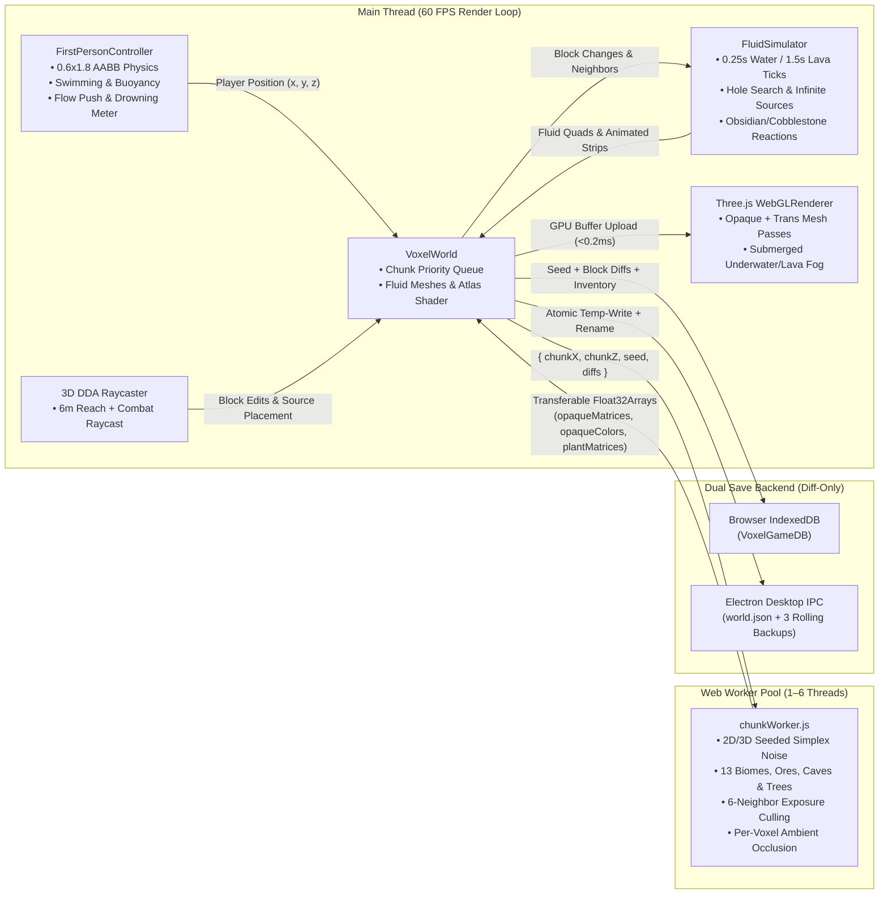
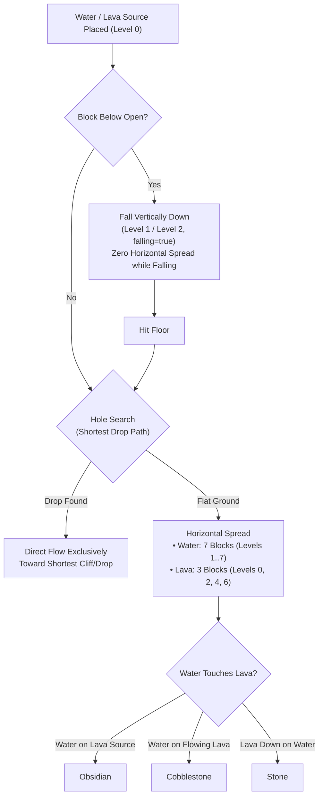
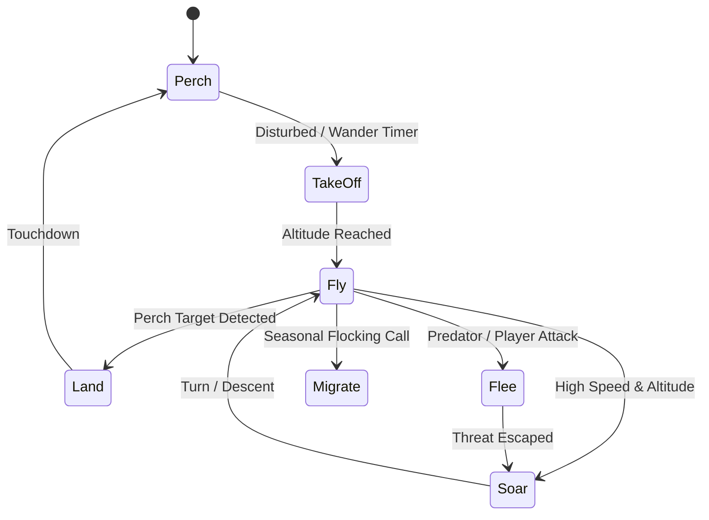

# Voxel Realms v2.0 — 3D Voxel Sandbox Engine (Three.js + Vite + Web Workers + Electron)

[](https://threejs.org/)
[](https://vitejs.dev/)
[](https://www.electronjs.org/)
[]()
[]()
[]()
[]()

**Voxel Realms** is a full-featured, browser- and desktop-ready 3D voxel sandbox game built from the ground up using **Three.js**, **Vite**, **ES Module Web Workers**, **Web Audio API**, **IndexedDB**, and **Electron**.

It implements **all 7 Core Development Phases (`Phases 0–6`)**, **all 8 Advanced Upgrade Phases (`Phases U0–U7`)**, and the complete **Minecraft-Style Fluid Physics Simulator, 13 Procedural Biomes & Old-Growth Forests, Multi-Attack Combat AI, 20-Day 4-Season Climate Engine, Reynolds Boids 3D Flying Birds, and 14 Sculpted Blender Mobs**.

---

## 📐 System Architecture

### 1. Multi-Threaded Chunk Generation & Rendering Pipeline


### 2. Core Engineering Principles
1. **Single Source of Truth Data Model:** Every chunk owns a `Map<"wx,wy,wz", blockType>` representing its solid and transparent voxels, and a dedicated `fluids` map for simulated water and lava flow. Visual meshes are strictly derived from this state.
2. **Off-Main-Thread Web Worker Meshing (`0 ms` UI Stalls):** Terrain noise sampling (`fbm2D` + `noise3D`), tree generation, 6-neighbor exposure culling, and per-voxel Ambient Occlusion execute inside a pool of background Web Workers (`src/workers/chunkWorker.js`) using zero-copy transferable `Float32Array` buffers.
4. **Deterministic Seeded Diff Persistence:** Natural terrain and settled water generate deterministically from the numeric seed (`133742`). Save files store **only player modifications** (`world.modifiedBlocks` diffs: broken blocks as `null` and placed blocks as `blockType`), keeping save payloads tiny regardless of world exploration distance.

---

## 📁 Repository Structure & Module Map

```text
voxel-game/
├── electron/                        # Native Desktop Application Shell
│   ├── main.cjs                     # Single-instance lock, window state, splash & atomic rolling saves
│   ├── preload.cjs                  # Secure contextBridge API (window.voxelDesktopAPI)
│   └── splash.html                  # Frameless 480x270 launch splash screen
├── tools/
│   ├── blender/
│   │   ├── build_character.py       # Articulated blocky character & animations generator (bpy)
│   │   ├── generate_all_mobs.py     # Headless 14-mob suite generator (bpy)
│   │   ├── all_mobs.blend           # Daytime, companion & feral mob models
│   │   └── night_horror_mobs.blend  # Night horror combatant models
│   └── generate-textures.js         # 102-tile outline-free seamless texture atlas generator
├── src/
│   ├── ai/
│   │   └── BirdFlightAI.js          # Real 3D bird flight finite state machine & Reynolds boids flocking
│   ├── climate/
│   │   ├── ClimateSystem.js         # 20-day 4-season cycle, temperature model, weather state machine & shader uniforms
│   │   └── AnimalClimateBehavior.js # Staggered climate behavior (Shelter, Rest, Drink, Huddle, Sleep) & flutter fall
│   ├── combat/
│   │   ├── AttackController.js      # Multi-attack cooldown tracker with 0.8s global recovery delay
│   │   ├── AttackRange.js           # Line-of-sight & swept distance boundary verifier
│   │   └── attacks/
│   │       ├── MeleeAttack.js       # Scythe slash & claw attack logic
│   │       ├── RangedMagicAttack.js # High-velocity swept magic projectiles
│   │       └── SoulBeamAttack.js    # Channeled 50% HP non-lethal soul drain beam
│   ├── config/
│   │   ├── animalClimate.js         # Animal climate thresholds, huddle radiuses & sleep schedules
│   │   ├── blocks.js                # Block properties, transparent flags, hardness & drops
│   │   ├── caves.js                 # 3D Simplex cave thresholds & worm tunnels
│   │   ├── climate.js               # Season calendar, day-length shifts, weather transition matrix
│   │   ├── fluids.js                # Fluid viscosity, tick rates, spread limits & thermic reactions
│   │   ├── mobs.js                  # Mob stats, bounding boxes, loot tables & spawn rules
│   │   ├── ores.js                  # Depth-stratified ore vein distribution
│   │   ├── spawning.js              # Mob population caps & spawn weightings
│   │   └── trees.js                 # Dark Oak (2x2), Autumn Maple & Giant Redwood (40m) procedural models
│   ├── fluids/
│   │   ├── FluidSimulator.js        # Discrete cellular automaton water & lava spread engine
│   │   └── FluidMesher.js           # Dynamic quad mesher with 4-corner height interpolation & animated strips
│   ├── workers/
│   │   └── chunkWorker.js           # Multi-threaded terrain noise, 13 biomes, exposure culling & AO
│   ├── BlenderMobs.js               # Articulated 3D mob rigs, procedural animation mixers & limb kinematics
│   ├── blocks.js                    # Block registrations, UV coordinates & isometric icon renderer
│   ├── character.js                 # Humanoid character rig & 3 camera modes (1st/3rd person)
│   ├── chunk.js                     # VoxelChunk container (opaque, cross-plants, transparent water)
│   ├── collision.js                 # 0.6x1.8 AABB collision solver with axis-separated step resolution
│   ├── controls.js                  # FirstPersonController, buoyancy, swimming, drowning & fly mode
│   ├── daylightBurn.js              # Open-sky daylight burn raycasting & shade detection
│   ├── hotbar.js                    # 9-slot Hotbar, 36-slot Inventory & 2x2 Crafting Grid
│   ├── inventory.js                 # Stack-based item storage (max 64) & crafting recipes
│   ├── lighting.js                  # Sun/moon directional light with texel-snapped shadow mapping
│   ├── main.js                      # 60 FPS loop, HUD, oxygen meter, screen tints, F3 telemetry & console
│   ├── mobAttacks.js                # Mob melee hitboxes, critical falls, knockback & item drops
│   ├── noise.js                     # Seeded 2D/3D Simplex noise, 13 biomes, forest ground details & trees
│   ├── polish.js                    # Web Audio SFX, atmospheric soundscapes, fireflies, sun/moon/stars & mobs
│   ├── projectiles.js               # Magic projectile pool & swept collision testing
│   ├── raycaster.js                 # 3D DDA voxel traversal raycaster & wireframe selection box
│   ├── statusEffects.js             # Player status effects (Poison, Bleed, Stagger, Fear, Weakness, Soul Drain)
│   ├── storage.js                   # IndexedDB & Electron IPC diff persistence engine
│   └── world.js                     # Chunk manager, Web Worker dispatcher & fluid simulation coordinator
```

---

## 🌊 Minecraft-Style Fluid Physics Simulation (`src/fluids/`)

Voxel Realms features a faithful, high-performance fluid simulation reproducing Minecraft's liquid mechanics:



### 1. Simulation Rules & Reactions
- **Water Behavior:** 0.25s tick delay; spreads horizontally up to 7 blocks (levels 1–7); drops by 1 level per block; 4-block hole search pathfinding.
- **Lava Behavior:** 1.5s tick delay (slower, viscous); spreads up to 3 blocks (levels 0, 2, 4, 6); drops by 2 levels per block; 2-block hole search pathfinding.
- **Infinite Water Sources:** Formed whenever an empty block has 2+ horizontally adjacent water sources over a solid or source floor.
- **Flow Retreat:** When a source block is removed, flowing liquid retreats and clears cleanly without leaving orphan fluid blocks.
- **Thermal Block Reactions:**
  - Water flowing horizontally over a Lava Source $\rightarrow$ **Obsidian**.
  - Water touching Flowing Lava $\rightarrow$ **Cobblestone**.
  - Lava falling vertically onto Water $\rightarrow$ **Stone**.

### 2. Variable-Height Quad Meshing & Animations (`src/fluids/FluidMesher.js`)
- **Variable Quad Heights:** Fluid surface height is calculated per corner using the Minecraft formula:
  $$h = \frac{8 - \text{level}}{9.0}$$
  (Falling columns and source blocks with fluid above render at a full height of `1.0`).
- **Smooth 4-Corner Averaging:** Each vertex height is averaged across adjacent fluid blocks to generate smooth downward slopes.
- **Animated 16-Frame Strips:** Real-time 10 Hz texture frame animation cycling 16 frames on 32×512 vertical strips for `water_still.png`, `water_flow.png`, `lava_still.png`, and `lava_flow.png`.

### 3. Entity Buoyancy, Swimming & Drowning Physics (`src/controls.js`)
- **Water Swimming:** Holding `Space` swims upward at **3.5 m/s**; sinking is clamped to a **2.0 m/s** terminal velocity; horizontal speed is damped to **0.5×** (or **0.72×** while sprinting).
- **Fall Damage Negation:** Entering water or lava instantly clears accumulated fall distance (`highestAirY = playerPosition.y`).
- **Fire & Lava Damage:** Lava deals **4 HP damage every 0.5s**; swimming in lava is clamped to **1.5 m/s** upward and **1.0 m/s** sink; exiting lava inflicts a **15-second fire burn** (1 HP/s). Stepping into water immediately extinguishes burning fire.
- **Fluid Flow Push Force:** Downward drag in falling fluid columns (**3.2 m/s**) and horizontal pushing downstream along surface gradients (**1.8 m/s**).
- **Oxygen & Drowning Meter:** Submerging the player's head depletes an air supply lasting **15.0 seconds** (represented by 10 animated bubbles on `#oxygen-bar`); running out of oxygen deals **2.0 DPS drowning damage**; oxygen refills at **5 bubbles/second** upon surfacing.
- **Camera Screen Tints & Fog:** Submerging into water applies a cyan screen tint and sapphire fog (`#1d4ed8`, density `0.065`); submerging into lava applies an orange-red screen tint and dense orange fog (`#ea580c`, density `0.40`).

---

## ⚔️ Night Mob Multi-Attack Combat & Status Effects (`src/combat/`)

Voxel Realms features a tactical 3-phase melee combat engine and specialized data-driven multi-attack bosses:

### 1. GrimWraith 3-Attack Combatant
The **GrimWraith** uses a dedicated [`AttackController`](file:///c:/Users/npal7/OneDrive/PROJECT/project1/voxel-game/src/combat/AttackController.js) with independent cooldowns and a 0.8s global recovery delay:
1. **Scythe Slash:** Fast melee slash dealing **4 damage** with **0.75 knockback** within 3.5m.
2. **Summon Skeletons:** Raises arms to summon up to **3 Bonewalker Skeletons** (`SoulSkeleton`), capped to prevent endless swarms.
3. **Soul Steal (`SoulBeamAttack`):** Long-range channeled soul beam dealing **50% of the player's current health** (non-lethal, leaving at least 1 HP); strictly blocked by solid block cover in line-of-sight.

### 2. SoulSkeleton Minion
- Fully articulated blocky skeleton with glowing teal soul core.
- Executes **Claw Scratch** (2 damage, 1.6m range).
- Burns in open daylight (4.0 DPS) and seeks shade/water.
- **Crumble Mechanic:** When the parent GrimWraith is slain, all summoned skeletons instantly collapse and crumble into dust.

### 3. Player Status Effects (`src/statusEffects.js`)
- **Poison:** Deals 1 damage every 1.5s; non-lethal (stops at 1 HP).
- **Bleed:** Deals 1 damage every 1.0s; lethal.
- **Stagger:** Locks player attacks and sprinting for 0.8s, followed by **3.0 seconds of stagger immunity**.
- **Fear:** Slows movement speed by 40% and produces screen shake.
- **Weakness:** Reduces player melee attack damage by 40%.
- **Soul Drain:** Drains 10% maximum health over time and depletes stamina.

---

## 🌲 Forest Biomes, Procedural Trees & Undergrowth Ecosystem (`src/noise.js`, `src/config/trees.js`)

Voxel Realms expands the world with 3 dedicated old-growth forest biomes, procedural tree canopy generators, and cross-plane ground flora:

### 1. New Forest Biomes
- **Darkwood Forest:** Dense, shadowy canopy dominated by massive 2×2 Dark Oak trees. The thick foliage blocks sunlight, fostering a lush understory with damp loamy `forest_floor`, wild red & brown mushrooms, and woodland ferns.
- **Autumn Maple Forest:** Vibrant temperate deciduous woodland with rolling hills covered in rich `maple_floor` mulch and multi-hued Maple trees sporting vivid crimson, burnt orange, and golden amber leaf canopies.
- **Giant Redwood Forest:** Primeval woodland populated by towering conifer sequoias rising **24 to 40 meters tall** from 2×2 and 3×3 flared root buttresses, resting on deep `needle_floor` turf interspersed with mossy stone boulders and fallen logs.

### 2. Procedural Tree Models (`src/config/trees.js`)
| Tree Type | Trunk Geometry | Canopy Architecture | Biomes | Special Details |
| :--- | :--- | :--- | :--- | :--- |
| **Dark Oak** | 2×2 solid wood core (height 7–11) | Broad 7×7 overlapping dome canopy | Darkwood Forest | Buttress root flairs & branches |
| **Autumn Maple** | 1×1 wood trunk (height 6–9) | Organic rounded 5×5 spherical canopy | Autumn Maple Forest | 3 color variants: Crimson, Amber, Gold |
| **Giant Redwood** | 2×2 / 3×3 flared base (height 24–40) | Multi-tiered coniferous conical cone | Redwood Forest | Massive vertical scale with crown spire |
| **Oak / Birch / Pine** | 1×1 wood trunk (height 5–9) | Classic voxel sphere / cone foliage | Meadows, Groves, Taiga | Standard temperate and boreal trees |

### 3. Cross-Plane Ground Flora & Forest Details (`src/chunk.js`, `src/blocks.js`)
- **Cross-Plane Instanced Rendering (`X`-Geometry):** Undergrowth plants render as instanced double-sided diagonal cross-planes with zero physics collision, alpha-tested cutouts, and wind-sway vertex shading:
  - **Woodland Ferns & Large Ferns:** Lush fronds spreading across shaded soils.
  - **Wild Mushrooms:** Red cap (`mushroom_red` with white spots) and broad brown cap (`mushroom_brown`).
  - **Woodland Wildflowers:** Bluebell (`flower_bluebell`), Violet (`flower_violet`), Wood Anemone (`flower_anemone`), Rose, and Dandelion.
  - **Tall Grass:** Natural tufts scattered across meadow and forest clearings.
- **Fallen Timber & Mossy Boulders:** Procedural generation naturally places fallen tree logs (aligned to X or Z axes), moss-covered stone boulders, and cut stumps on the forest floor.
- **Bioluminescent Fireflies (`src/polish.js`):** At dusk and night, ambient swarms of soft glowing fireflies float through deep woodland canopies with sinusoidal brightness oscillations.

---

## ⛅ Climate, 4-Season Cycle & Dynamic Weather (`src/climate/ClimateSystem.js`)

A comprehensive climate simulation engine drives world temperature, seasonal day-length shifts, dynamic weather transitions, and zero-remesh GPU seasonal shading:

### 1. 20-Day Calendar Year
- A full year lasts **20 in-game days**, divided evenly across **4 distinct seasons** (5 days per season):
  - **Spring (Days 1–5):** Fresh vibrant greens, moderate rain showers, gentle warming.
  - **Summer (Days 6–10):** Sweltering heat, long daylight hours, dry spells, occasional thunderstorms.
  - **Autumn (Days 11–15):** Crisp cooling air, golden and crimson foliage transitions, increased wind and overcast skies.
  - **Winter (Days 16–20):** Sub-zero freezing temperatures, short daylight hours, snowfall, blizzards, and frost accumulation.

### 2. Environmental Temperature & Altitude Model
World temperature is calculated per block dynamically without memory allocations:
$$T(x, y, z) = T_{\text{biome\_base}} + \Delta T_{\text{season}} + \Delta T_{\text{diurnal}} - 0.28^\circ\text{C} \times (y - 18)$$
- **Altitude Lapse Rate:** Temperatures drop by **0.28°C per block above sea level** ($y = 18$), causing high mountain peaks and upper canopies to freeze while low valleys stay warm.
- **Diurnal Fluctuation:** Natural solar cycle swing (warmest at solar noon, coldest before dawn).
- **Seasonal Offsets:** Spring ($+0^\circ\text{C}$), Summer ($+8^\circ\text{C}$), Autumn ($-2^\circ\text{C}$), Winter ($-15^\circ\text{C}$).

### 3. Dynamic Day-Length Seasonal Shifting
- **Summer Solstice:** Longest days with night compressed between solar progress `0.60` and `0.90` (extended golden daylight).
- **Winter Solstice:** Shortest days with nights spanning solar progress `0.51` to `0.99` (long, dark freezing nights).

### 4. Markov Weather State Machine & Precipitation
- Continuous weather transitions: `clear` $\leftrightarrow$ `overcast` $\leftrightarrow$ `rain` $\leftrightarrow$ `thunderstorm` $\leftrightarrow$ `snow` / `blizzard` $\leftrightarrow$ `dust_haze`.
- **Local Precipitation Logic:**
  - $T < 0^\circ\text{C} \implies$ precipitation falls as **Snow** or **Blizzard**.
  - Arid Desert biomes $\implies$ precipitation manifests as **Dust Haze**.
  - Temperate & humid biomes $\implies$ precipitation falls as **Rain** or **Thunderstorm**.

### 5. Zero-Remeshing GPU Seasonal Shader Uniforms
Seasonal transitions do not trigger heavy chunk rebuilds; instead, global uniforms dynamically modify terrain shading directly on the GPU:
- `uSeasonTint`: Smoothly tints grass, leaves, and foliage across the seasons (Spring lime $\to$ Summer emerald $\to$ Autumn amber $\to$ Winter frost).
- `uLeafDensity`: Modulates canopy alpha and thinning during late autumn and winter.
- `uSnowAmount`: Progressively accumulates white snow frost on upward-facing block surfaces during winter snowfall.
- `uWetDarken`: Deepens block color saturation and boosts specular highlights during rainfall.

### 6. Procedural Web Audio Ambient Soundscapes (`src/polish.js`)
- Zero-asset Web Audio synthesis produces continuous procedural soundscapes:
  - Soft raindrops pattering on leaves and whistling winter gales.
  - Distant stereo-panned thunder claps with low-frequency rumble.
  - Melodic spring birdsong chirps and warm summer cricket chirps.

---

## 🐑 Climate-Driven Animal Behavior & Gentle Chicken Flutter Fall (`src/climate/AnimalClimateBehavior.js`)

Animals dynamically respond to ambient temperature, weather conditions, time of day, and falling physics:

### 1. Staggered 1-Second AI Evaluation
- Evaluation routines run on a staggered 1.0-second tick budget across active mobs, ensuring lightweight execution with **zero impact on 60 FPS frame rates**.

### 2. Behavioral Response Matrix
| State | Trigger Conditions | Behavioral AI Response |
| :--- | :--- | :--- |
| **`Shelter`** | Rain, Blizzard, or Thunderstorm | Mobs navigate to nearby tree canopies or cave overhangs; movement speed dampened to 85%; flight prohibited. |
| **`Rest`** | High temperature ($T > 30^\circ\text{C}$) during midday | Mobs seek shade beneath foliage and slow their wandering speed. |
| **`Drink`** | Hot / dry weather near open water blocks | Thirsty animals steer toward water blocks to drink and rehydrate. |
| **`Huddle`** | Freezing winter cold ($T < 2^\circ\text{C}$) | Herd mobs (Cows, Sheep, Pigs) gather in tight clusters (herd attraction doubled; wander radius contracted by 55%) to share body heat. |
| **`Sleep`** | Nighttime hours (dusk to dawn) | Passive mobs lie down and enter dormant sleep, reducing movement to near-zero. |

### 3. Gentle Chicken Flutter Fall Physics
- When a **Chicken** falls from any height (`velocityY < 0` in air), it activates a rapid wing-flapping animation and clamps its terminal downward fall velocity to **`-1.8 m/s`** (compared to standard gravitational terminal velocity of `-24 m/s`).
- Fall damage is completely eliminated, allowing chickens to float softly down tree canopies and sheer mountain cliffs.

---

## 🦅 Real 3D Flying Bird AI & Reynolds Boids Flocking Engine (`src/ai/BirdFlightAI.js`)

Birds feature true 3D aerial navigation, flocking dynamics, obstacle avoidance, and flight state transitions:



### 1. 3D Flight Physics (Zero Gravity Restriction)
- Birds operate with an unconstrained 3D velocity vector, navigating the sky freely with pitch, yaw, and banking roll without ground gravity constraints.

### 2. 7-State Flight State Machine
1. **`Perch`:** Rest on treetop canopies or cliff edges with folded wings and periodic head-bobbing.
2. **`TakeOff`:** Accelerates forward and pitches upward into open airspace.
3. **`Fly`:** Steady cruising flight with rhythmic procedural wing flapping.
4. **`Soar`:** Wings extended in a stationary glide, riding thermal updrafts at high altitudes.
5. **`Land`:** Flaps decelerate as the bird flares its wings to settle precisely onto an elevated block.
6. **`Flee`:** Rapid emergency flight burst away from incoming players or hostile mobs.
7. **`Migrate`:** High-altitude coordinated flock journey toward warmer biomes.

### 3. Reynolds Boids Flocking Algorithm
Flocking birds simulate organic group behaviors using classical Boids steering:
- **Separation:** Repels birds from neighbors within `3.0m` to prevent collisions.
- **Alignment:** Steers each bird toward the average flight heading and velocity of flockmates within `12.0m`.
- **Cohesion:** Attracts each bird toward the flock's collective center of mass within `15.0m`.

### 4. 3D Terrain Raycast Obstacle Avoidance
- Real-time forward raycasting scans 6 blocks ahead for solid obstacles, canopies, and cliffs. When an obstacle is detected, the AI injects upward climb thrust (`vy = +4.0 m/s`) or banks yaw laterally away from the obstruction.
- Procedural banking rolls the bird's body into sharp turns up to 35°, matching real aerodynamic flight dynamics.

---

## 🎮 Controls & Keybindings

| Input / Key | Action |
| :--- | :--- |
| **Click 3D View** | Engage Mouse Look (**Pointer Lock API**) |
| **`W` `A` `S` `D`** | Walk / Strafe (`Ctrl` or `Shift` to Sprint with dynamic FOV widening) |
| **`Space`** | **Jump** (on land), **Swim Up** (in Water: 3.5 m/s; in Lava: 1.5 m/s), or **Fly Up** (in Fly Mode) |
| **Double-Tap `Space` / `F`** | Toggle **Survival AABB Physics** $\leftrightarrow$ **Free Fly Mode** |
| **Left-Click** | **Attack Mob** (within `3.8m` reach; critical hit while falling) or **Mine Block** |
| **Right-Click** | **Place Block** or **Place Fluid Source** from active Hotbar slot |
| **`1` – `9` / Scroll Wheel** | Select Hotbar Slot (`1`–`9`) |
| **`E`** | Open / Close **36-Slot Inventory, 2×2 Crafting Grid & Recipe Book** |
| **`V`** | Cycle Camera View (`1st-Person` $\rightarrow$ `3rd-Person Back` $\rightarrow$ `3rd-Person Front`) |
| **`F3`** | Toggle **Developer Diagnostics & Performance Telemetry Overlay** |
| **`F4`** | Toggle **Combat Range Rings & Line-of-Sight Visualizer** |
| **`F6`** | Toggle **Cave & Ore X-Ray Mode** |
| **`F2`** | Capture **PNG Screenshot** |
| **`/`** | Open **In-Game Command Console** |
| **`M`** | Open **Pause & Settings Menu** |
| **`P`** | Manual Save World (`IndexedDB` + Desktop IPC) |
| **`T`** | Advance **Day / Dusk / Night / Dawn** Cycle |
| **`B`** | Cycle-spawn each of the 14 sculpted 3D Blender mobs |

---

## 💻 In-Game `/` Console Commands

Press **`/`** during gameplay to open the command console and run any of the following:

### 🌊 Fluid & Liquid Physics Commands
| Command | Example | Description |
| :--- | :--- | :--- |
| `/fluidstats` | `/fluidstats` | Displays active flowing fluid blocks, queued updates, sim execution time, and pending remesh chunks |
| `/fluidtick <n>` | `/fluidtick 5` | Manually steps the fluid simulator by `n` ticks and triggers instant chunk re-meshing |
| `/fluiddebug <on\|off>` | `/fluiddebug on` | Toggles detailed fluid physics console telemetry and update logging |

### ⛅ Climate, Season & Weather Commands
| Command | Example | Description |
| :--- | :--- | :--- |
| `/climate` | `/climate` | Displays current season, day count, local temperature (°C), active weather, and precipitation type |
| `/season <spring\|summer\|autumn\|winter>` | `/season winter` | Instantly advances calendar to target season and triggers gradual temperature and foliage shifts |
| `/weather <clear\|rain\|snow>` | `/weather rain` | Sets active weather state, precipitation particle system, and sky lighting |
| `/climatedebug` | `/climatedebug` | Outputs full climate telemetry table (season progress, wind vector, precip intensity, cloud cover) to DevTools console (F12) |
| `/timespeed <multiplier>` | `/timespeed 5.0` | Scales day/night cycle and seasonal progression speed (e.g. 5x, 10x) |

### 🐾 Mob, Bird & Combat Commands
| Command | Example | Description |
| :--- | :--- | :--- |
| `/spawn <MobType> [count]` | `/spawn Cow 4` | Spawns a single mob or a cohesive herd/group (count $\ge 2$) in front of the player |
| `/spawnflock [count]` | `/spawnflock 6` | Spawns a flock of flying birds with active Reynolds boids flocking behavior |
| `/birdstate <State>` | `/birdstate Soar` | Forces nearest flying bird into a flight state (`Perch`, `TakeOff`, `Fly`, `Soar`, `Land`, `Flee`, `Migrate`) |
| `/forceattack <MobType> <attackId>` | `/forceattack GrimWraith soul_steal` | Forces a mob to execute an attack immediately, bypassing active cooldowns |
| `/mobdebug <on\|off>` | `/mobdebug on` | Toggles 3D combat range rings, state labels, and attack cooldown indicators |
| `/mobai <on\|off>` | `/mobai off` | Freezes or unfreezes all mob artificial intelligence for inspection |
| `/killmobs` | `/killmobs` | Immediately despawns all active hostile and summoned mobs |
| `/testrange` | `/testrange` | Spawns a melee mob at 3.0m distance with F4 combat debug ring enabled to test windup & miss |
| `/spawnstats` | `/spawnstats` | Prints mob population counts by class (passive, predator, night) and last 10 spawn attempt logs |

### ⚔️ Player, Inventory & World Commands
| Command | Example | Description |
| :--- | :--- | :--- |
| `/gamemode <fly\|survival>` | `/gamemode fly` | Toggles between Free Fly Mode and `0.6×1.8` AABB Gravity/Collision Mode |
| `/give <item> <count>` | `/give water_source 16` | Adds items to inventory (supports `water_source`, `lava_source`, all ores, logs, tools) |
| `/heal` | `/heal` | Restores all 10 Health Hearts (`20 HP`), Stamina, and clears all status effects |
| `/effect <effectId> [duration]` | `/effect poison 8` | Applies a status effect (`poison`, `bleed`, `stagger`, `fear`, `weakness`, `drain`) |
| `/clearfx` | `/clearfx` | Clears all active player status effects |
| `/tp <x> <y> <z>` | `/tp 0 32 0` | Teleports player to world coordinates `(x, y, z)` and reloads surrounding chunks |
| `/time set <day\|night\|sunset>` | `/time set night` | Instantly advances solar clock to day (`0.25`), sunset (`0.52`), or night (`0.72`) |
| `/biome` | `/biome` | Prints detailed biome information at player's current position (name, surface, sub, sea-level) |
| `/biomemap` | `/biomemap` | Toggles top-down 480×480m 2D biome region minimap canvas overlay |
| `/orestats` | `/orestats` | Analyzes and prints total counts and per-chunk averages for all ores across loaded chunks |
| `/gallery` | `/gallery` | Constructs a 36-block seamless showcase gallery grid directly ahead of the player |

---

## 🐾 Complete 14-Mob Blender Suite (`tools/blender/`)


All **14 custom 3D mobs** sculpted in Blender are integrated with distinct AI, procedural animations, and combat hitboxes:

### ☀️ Daytime, Companion & Feral Mobs (10)
1. **`Pig`** — Plump pink body, beveled snout, blush cheeks, 4 hooves, helical curly tail.
2. **`Dog`** — Guard Dog with mahogany/obsidian coat, 8-spike studded collar, fangs & bushy tail.
3. **`Cow`** — Dairy cow with black spots, pink muzzle, udder, curved horns & tufted tail.
4. **`Sheep`** — Fluffy wool puffs, head wool cap, charcoal face & ears.
5. **`Rabbit`** — White cotton-tail bunny with tall pink-lined ears, buck teeth & bounding hop.
6. **`Bird`** — Raptor Falcon with 3D flight AI, soaring glide, hooked beak & talons.
7. **`Cat`** — Ginger cat with emerald eyes, pink nose & upright S-curve tail.
8. **`Chicken`** — Farm chicken with red comb, flapping wings & gentle flutter fall.
9. **`Wolf`** — Aggressive Dire Wolf with dorsal hackles, glowing red eyes & snarling fangs.
10. **`Monkey`** — Feral Mandrill Ape with war-paint ridges, 4 saber fangs & clawed fists.

### 🌙 Night Horror Hostile Mobs (4)
11. **`ShadowStalker`** — Towering Wendigo with bleached stag skull, crimson void eyes, glowing heart core & bone-scythe claws.
12. **`BloodCrawler`** — Abyssal Spider with metallic chitin thorax, swollen blood-sac abdomen, 8 crimson eyes & venom mandibles.
13. **`GrimWraith`** — Hooded Soul Reaper with soul-fire chest vortex, scythe slash, skeleton summoning & channeled soul steal.
14. **`FleshGhoul`** — Hulking Mutant Crawler with asymmetric gore shoulder, 6 erupting dorsal bone spikes, split mandible jaws & bone-blade arms.

---

## 🎨 HD Procedural Block Texture Atlas & Zero-Outline Seamless Shading (`tools/generate-textures.js`)


Every block and undergrowth plant in Voxel Realms renders with high-detail pixel-art textures packed into a unified 1024×1024 texture atlas (`public/assets/textures/atlas.png` & `atlas.json`, `NearestFilter`, `SRGBColorSpace`, half-texel UV inset `eps = 0.003`) deterministically generated by [`tools/generate-textures.js`](file:///c:/Users/npal7/OneDrive/PROJECT/project1/voxel-game/tools/generate-textures.js):

### 1. 102 Procedurally Hand-Crafted Atlas Tiles
- **Zero Block Outlines:** Unlike traditional voxel engines with heavy tile borders, tiles use continuous color ramp edge blending so adjacent blocks (plains grass, stone cliffs, wood plank floors, dark oak bark, leaves) blend together into clean, seamless continuous surfaces.
- **Surface Variances (Tiles 0–14):** 3 distinct variants each for `grass_top_a/b/c`, `dirt_a/b/c`, and `stone_a/b/c` to eliminate repetitive checkerboard patterns across vast natural vistas.
- **Wood Families & Forestry (Tiles 15–35, 71–85):**
  - **Oak:** `log_oak_side/top`, `planks_oak`, `leaves_oak`
  - **Birch:** `log_birch_side/top`, `planks_birch`, `leaves_birch`
  - **Spruce/Pine:** `log_pine_side/top`, `planks_pine`, `leaves_pine`
  - **Dark Oak:** `log_dark_oak_side/top`, `planks_dark_oak`, `leaves_dark_oak`
  - **Autumn Maple:** `log_maple_side/top`, `planks_maple`, and tri-color deciduous leaves (`leaves_maple_red`, `leaves_maple_orange`, `leaves_maple_yellow`)
  - **Giant Redwood:** `log_redwood_side/top`, `planks_redwood`, `leaves_redwood`
  - **Forest Soils:** `forest_floor`, `maple_floor`, `needle_floor`
- **Ores & Minerals (Tiles 36–50):** Deep coal, iron, gold, redstone, diamond/crystal, and emerald clusters with specular highlights.
- **Animated Liquid Strips:** 16-frame 10 Hz animated vertical strips for `water_still`, `water_flow`, `lava_still`, and `lava_flow`.
- **Cross-Plane Decorative Plants (Tiles 86–101):**
  - Woodland Ferns (`fern`, `fern_large`)
  - Tall Grass (`tall_grass_plant`)
  - Forest Mushrooms (`mushroom_red`, `mushroom_brown`)
  - Woodland Wildflowers (`flower_bluebell`, `flower_violet`, `flower_anemone`, `flower_rose`, `flower_dandelion`)

---

## 🧪 Automated QA Suite & Testing Coverage

Voxel Realms maintains automated test suites verifying world generation determinism, combat range boundaries, fluid physics, and climate systems:

```bash
# Run the Master 48-Test QA Suite
node tests/run_qa_suite.js

# Run the 7-Scenario Fluid Simulator Suite
node tests/fluids.test.js
```

| Suite | Tests | Result | Coverage Details |
| :--- | :---: | :---: | :--- |
| **Task F1 Melee Verification** | 6 | **PASS** | Edge-to-edge range boundaries, floor reachY checks, solid wall LOS, windup miss |
| **Task F2 Day/Night Spawning** | 3 | **PASS** | Clock boundaries (55%–95%), behavior classes, version 3 save warnings |
| **Task F3 Ranged Magic Combat** | 2 | **PASS** | Swept projectile collision (14 m/s), sidestep miss, stone wall blocking |
| **Task F4 & F5 Cave & Ore Gen** | 3 | **PASS** | 12m spawn protection, reverse chunk order determinism, 5-seed benchmark |
| **Night Mob Combat System** | 4 | **PASS** | 6 status effects, 3s stagger immunity, 12 night mob attacks, daylight burn |
| **Part A & B Regions & Jump** | 2 | **PASS** | 65,536-column purity audit, 1-block auto-jump, 2-block turn away, unstuck push |
| **GrimWraith & Skeletons** | 6 | **PASS** | AttackController cooldowns, tactical AI, scythe slash, soul beam, skeleton crumble |
| **Fluid Simulator (FL1.1–FL1.7)** | 7 | **PASS** | 7-block water spread, vertical fall, hole search, infinite sources, lava, reactions |
| **Extended Forest, Climate & Birds** | 15 | **PASS** | Biome definitions, 4 seasons, temperature formula, animal behavior, 3D bird AI |
| **Total Automated Tests** | **48** | **PASS** | **100% Pass Rate with 0 Failures** |

---

## 🚀 Running Locally (Web & Desktop)

### Prerequisites
- **Node.js** `v18+` (tested with `v24.19.0`) and **npm**

### 1. Clone & Install
```bash
git clone https://github.com/npal78229-eng/voxel-game.git
cd voxel-game
npm install
```

### 2. Run in Browser (Vite Dev Server)
```bash
npm run dev
```
Open **`http://localhost:5173/`** in Chrome, Edge, or Firefox.

### 3. Build Production Bundle
```bash
npm run build
npm run preview
```

### 4. Run as Native Electron Desktop App (Optional)
```bash
npm run app:dev
```
Or build the standalone Windows `.exe` installer into `release/`:
```bash
npm run app:dist
```
